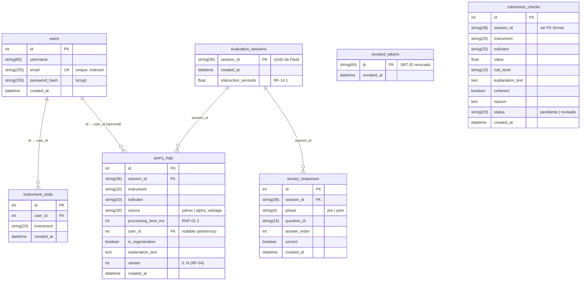

# Modelo entidad-relación — `appfint.db`

**Motor**: SQLite (archivo `appfint.db`, recreado desde cero con `db.create_all()` al arrancar la app; no hay migraciones).
**Fuente de verdad**: modelos SQLAlchemy en `src/auth/models.py` y `src/evaluation/models.py`.

Este diagrama refleja las 7 tablas reales. Las flechas apuntan del "muchos" al "uno" (FK → PK).

## Notas de diseño

- **`revoked_tokens` es independiente** (sin FK a `users`): un JWT sigue siendo revocable aunque el usuario se borre. La lista se consulta en el callback `token_in_blocklist` de Flask-JWT-Extended.
- **`coherence_checks.session_id` no tiene FK formal** (sí es UUID de sesión igual que en `evaluation_sessions`, pero la columna se declara suelta). Si algún día se activa integridad referencial completa, tocaría agregarla.
- **`query_logs.user_id` es opcional**: consultas anónimas (sin login) dejan la columna en NULL y siguen funcionando. Cuando hay JWT válido, se asocia para el perfil adaptativo (RF-18.1).
- **`instrument_visits` vs `query_logs`**: una selección de instrumento en el dashboard produce **1** `InstrumentVisit` (para el perfil de aprendizaje) y **4** `QueryLog` (uno por indicador consultado en paralelo). Ver comentario en `src/evaluation/models.py:57`.
- **Sin tabla de precios**: todos los datos históricos son efímeros y viven en `TTLCache` (memoria, TTL 5 min). La BD es solo estado de la aplicación, no espejo del mercado.

## Ver los datos reales

Instalar en VS Code la extensión **SQLite Viewer** (`qwtel.sqlite-viewer`) y hacer doble-clic en `appfint.db` para navegar las 7 tablas como en cualquier IDE (DBeaver, DataGrip). Cada columna es filtrable y ordenable; no reemplaza SQL, pero para inspección visual alcanza.
