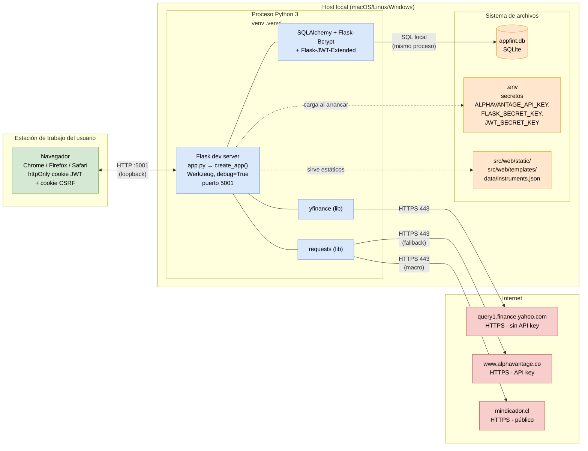

# Diagrama de despliegue — appfint

**Escenario actual (desarrollo / anteproyecto)**: la app corre localmente con el servidor de desarrollo de Flask en `127.0.0.1:5001`. No hay contenedor, ni orquestación, ni servidor web adelante. La base de datos es un archivo SQLite en el mismo directorio del código.

Este diagrama muestra los **nodos físicos** (máquinas y procesos) y las **conexiones de red reales** que ocurren en ejecución.

## Características del despliegue actual

| Aspecto | Valor real hoy | Comentario |
|---|---|---|
| Servidor de aplicaciones | Werkzeug dev server (`app.run(debug=True)`) | **No apto para producción**: single-threaded, sin límites de conexiones. |
| Puerto | 5001 (loopback) | Definido en `app.py:8`. |
| Base de datos | SQLite archivo local `appfint.db` | Se recrea con `db.create_all()` al arrancar si no existe (no hay migraciones). |
| Autenticación | JWT en cookie httpOnly + CSRF token en cookie JS-readable | Ver `config.py:20-25`. Cookie `Secure` off en dev. |
| Cache | En memoria del proceso (`TTLCache`, 5 min) | Se pierde al reiniciar. No hay Redis ni memcached. |
| Secretos | Archivo `.env` en el repo (no versionado) | `python-dotenv` los carga en `Config`. |
| Fuentes externas | 3 servicios HTTPS, sin proxy ni caché intermedio | Yahoo es la primaria; Alpha Vantage es fallback (RNF-08). |

## Qué cambiaría un despliegue productivo (fuera del alcance del anteproyecto)

Anotado solo como referencia si el proyecto continúa después:

- **Servidor WSGI** (gunicorn o uWSGI) detrás de un reverse proxy (nginx) para servir estáticos y terminar TLS.
- **Base de datos** PostgreSQL en vez de SQLite (concurrencia real, backups, migraciones con Alembic).
- **`JWT_COOKIE_SECURE=true`** obligatorio (requiere HTTPS).
- **Cache compartido** (Redis) si hay más de un worker: `TTLCache` en memoria deja de ser coherente entre procesos.
- **Secretos** fuera del filesystem: gestor de secretos del proveedor (AWS Secrets Manager, etc.).
- **Observabilidad**: log estructurado + métricas (Prometheus) + tracing (los `processing_time_ms` que ya escribimos en `query_logs` son la base).
