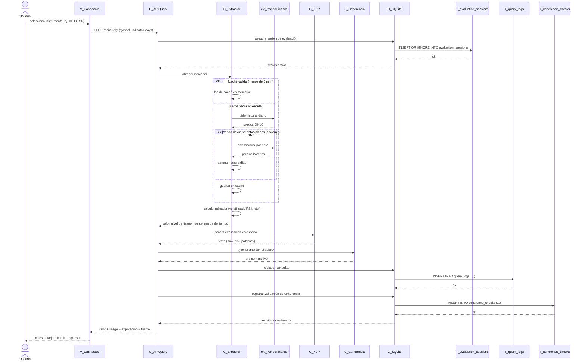

# CU-01 — Consultar indicador financiero

**Actor**: Usuario (anónimo o autenticado).
**Precondición**: catálogo cargado, sesión de evaluación establecida.
**Postcondición**: usuario ve tarjeta con valor + nivel de riesgo + explicación en español; queda registro en `query_logs` y una validación en `coherence_checks`.
**Requerimientos cubiertos**: RF-01, RF-02 (extracción y trazabilidad), RF-03 (normalización), RF-04 (explicación NLP), RF-06.1 (clasificación de riesgo), RF-13 (coherencia semántica), RNF-01 (respuesta < 5s), RNF-02.2 (caché 5 min), RNF-08 (respaldo Yahoo → Alpha Vantage).

## Notas del flujo

- **Gestor de BD**: `C_SQLite` representa la capa que abre la conexión y ejecuta el SQL. En el código real es **SQLAlchemy** (ORM) sobre `appfint.db`. Se separa del controlador principal (`C_APIQuery`) siguiendo la convención UML pedida.
- **Tablas específicas involucradas**:
  - `T_evaluation_sessions` — sesión anónima (UUID) para trazar la interacción (RF-14).
  - `T_query_logs` — cada consulta indicador queda registrada con tiempo de procesamiento, fuente, usuario si hay sesión (RF-18).
  - `T_coherence_checks` — resultado del validador semántico (RF-13) para revisión posterior en `/admin/coherencia`.
- **Cuatro consultas en paralelo** (no dibujado): al seleccionar un instrumento el dashboard dispara **4 llamadas** a `C_APIQuery` (una por indicador: volatilidad, RSI, medias móviles, rentabilidad). Este diagrama muestra el flujo de UNA consulta; multiplicar por 4 mentalmente.
- **Caché compartida**: la caché guarda por `(instrumento, período)`, así que una sola llamada a Yahoo alcanza para los 4 indicadores y el gráfico del mismo instrumento (RNF-02.2).
- **Respaldo horario para acciones chilenas** (`.SN`): cuando Yahoo devuelve datos "planos" (volumen 0 o cierres idénticos) en el rango diario, el extractor pide el rango por hora y los agrega a días. Común en la Bolsa de Santiago para períodos cortos.
- **Nivel de detalle adaptativo** (RF-18.3): si el usuario está autenticado y ya regeneró la explicación de ese indicador 2 o más veces, el generador usa la variante "detallada". La consulta al historial de regeneraciones se omite del diagrama por claridad.
- **Errores no dibujados**: si Yahoo y Alpha Vantage fallan ambos, `C_Extractor` lanza error y `C_APIQuery` responde 502 con mensaje amigable en español (RF-09.1).
