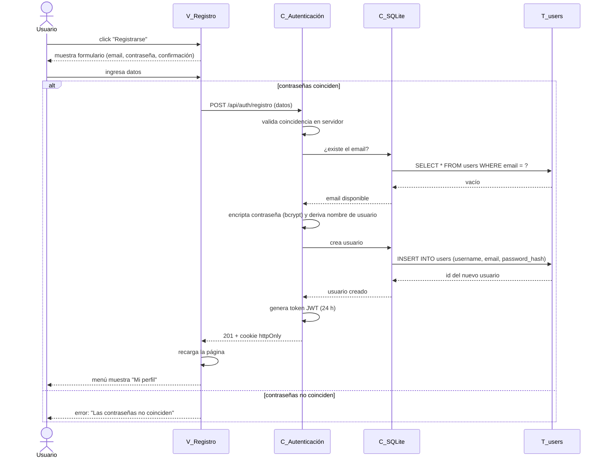

# CU-11 — Registro de usuario

**Actor**: Usuario (invitado, sin cuenta)
**Precondición**: usuario navegando en cualquier página, sin sesión activa.
**Postcondición**: nueva fila en la tabla `users`; usuario autenticado con cookie JWT.
**Requerimientos cubiertos**: RF-16, RF-16.2 (email único), RF-16.3 (bcrypt), RNF-09.1 (mínimo 8 caracteres), RNF-09.2 (JWT 24h).

## Notas del flujo

- **Endpoint real**: `POST /api/auth/registro` (`src/auth/routes.py:32`).
- **Gestor de BD**: `C_SQLite` representa la capa que abre la conexión y ejecuta el SQL. En el código real es **SQLAlchemy** (ORM) sobre `appfint.db`. Se dibuja como participante propio para hacer visible la separación entre lógica de negocio (`C_Autenticación`) y acceso a datos, siguiendo la convención pedida.
- **Tabla específica**: la única tabla involucrada es `users` (`src/auth/models.py:12`) — columnas: `id`, `username`, `email` (único, indexado), `password_hash` (bcrypt), `created_at`.
- **Validación doble** (RNF-09.1): la coincidencia de contraseñas se valida en el navegador y también en el servidor. Si el navegador se salta la validación, el servidor rechaza con 400.
- **Nombre de usuario auto-derivado**: se toma el prefijo del email (antes del `@`) limpiando caracteres no alfanuméricos. Si ya existe otro usuario con ese nombre, se agrega sufijo numérico (`ximena_2`, `ximena_3`).
- **Sesión inmediata**: el registro deja al usuario ya autenticado con cookie JWT, sin pedirle iniciar sesión aparte (CU-11 requerimiento).
- **Errores no dibujados**: 409 si el email ya está registrado; 400 si la contraseña tiene menos de 8 caracteres.
