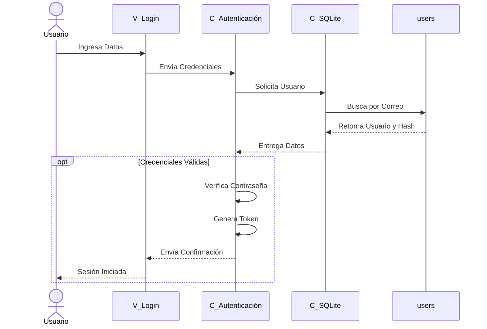

# CU-12 — Inicio de sesión

**Actor**: Usuario ya registrado, sin sesión activa.
**Precondición**: existe una fila en la tabla `users` con el email del usuario.
**Postcondición**: cookie JWT emitida, sesión activa, vista de perfil disponible.
**Requerimientos cubiertos**: RF-17, RF-17.2 (JWT en cookie httpOnly), RNF-09.2 (expira 24h), mensaje genérico ante fallo (CU-12 Excepción 1).

## Notas del flujo

- **Endpoint real**: `POST /api/auth/login` (definido en `src/auth/routes.py:60`). La ruta `/login` sirve únicamente la página HTML del formulario, no procesa credenciales.
- **Gestor de BD**: `C_SQLite` representa la capa que abre la conexión y ejecuta la consulta. En el código real es **SQLAlchemy** (ORM) sobre el archivo `appfint.db`. El profesor puede referirse a este componente como "controlador MySQL" por convención de plantilla — el patrón es el mismo, cambia solo el motor de BD.
- **Tabla específica**: la única tabla involucrada es `users` (`src/auth/models.py:13`, `__tablename__ = "users"`). Columnas: `id`, `username`, `email` (único, indexado), `password_hash` (bcrypt), `created_at`.
- **¿Quién decide si las credenciales son válidas?**: **`C_Autenticación`**, no la tabla. La tabla devuelve la fila del usuario con el `password_hash`; recién ahí `C_Autenticación` ejecuta `bcrypt.check_password_hash()` para comparar.
- **Por qué `opt` en vez de `alt/else`**: el eje vertical de un diagrama de secuencia es tiempo. Un `alt/else` visualmente se lee como si ambas ramas ocurrieran una tras otra, cuando en realidad son excluyentes. Usar `opt` (mostrando solo el flujo feliz) preserva la lectura temporal.
- **Manejo del flujo alternativo** (CU-12 Excepción 1): tanto "email no registrado" como "contraseña incorrecta" caen en la **misma rama** — la tabla devuelve vacío o el hash no coincide, y `C_Autenticación` genera un error genérico ("Correo o contraseña incorrectos") sin distinguir cuál falló. Está documentado en el CU-12 como texto; no se dibuja acá para no quebrar la secuencia.
- **Cookie httpOnly**: la cookie del token no es accesible desde JavaScript, lo que mitiga ataques XSS. La protección CSRF se maneja aparte con un segundo token en cookie separada.
- **La contraseña nunca se procesa en el navegador**: viaja solo entre `V_Login` y `C_Autenticación` (protegida por HTTPS en producción). La verificación bcrypt corre siempre en el servidor.
