# Fase 4 — Diagrama de componentes

**Notación**: UML 2.5, sintaxis PlantUML. Componentes con estereotipo `<<component>>`; interfaces provistas/requeridas mediante notación *ball-and-socket*; líneas simples (`--`) para conexiones (la comunicación HTTP es petición/respuesta, no dirigida).

**Grounding**: cada componente y cada línea de este diagrama corresponde a un módulo o import verificable en `src/`. La tabla de trazabilidad al final lista el paquete Python asociado a cada componente.

## Diagrama

```plantuml
@startuml
skinparam componentStyle rectangle
skinparam packageStyle rectangle
skinparam shadowing false
skinparam defaultFontName "Helvetica"

skinparam component {
  BackgroundColor<<arch>>     #FFE4B5
  BorderColor<<arch>>         #C79020
  BackgroundColor<<negocio>>  #D8BFD8
  BorderColor<<negocio>>      #7B4B94
}

actor Usuario

interface "Consultas HTTP"           as IWeb
interface "Precios Históricos"       as IPrecios
interface "Indicadores Macro Chile"  as IMacro
interface "Cuentas y Consultas"      as IBD

package "Aplicación web (Flask · Jinja2 · Vanilla JS)" {

  ' --- Componentes de arquitectura genérica (routing, auth, sesión) ---
  component "Enrutar Consulta y\nRegenerar Explicación"   <<arch>>  as Consulta
  component "Registro Cuenta Nueva"                       <<arch>>  as Registro
  component "Iniciar / Cerrar Sesión"                     <<arch>>  as Sesion
  component "Ofrecer Autoevaluación"                      <<arch>>  as Encuesta
  component "Ofrecer Auditoría de\nCoherencia"            <<arch>>  as RutaAuditoria

  ' --- Componentes de lógica de negocio específica ---
  component "Obtener Precios"                                          <<negocio>>  as ObtenerPrecios
  component "Calcular Indicadores\n(RSI · MACD · MA · Bollinger)"     <<negocio>>  as CalcularInd
  component "Obtener Indicadores Macro"                                <<negocio>>  as ObtenerMacro
  component "Clasificar Sentimiento\n(FinBERT)"                       <<negocio>>  as Clasificar
  component "Generar Explicación\n(Plantillas ES + Variantes)"        <<negocio>>  as Generar
  component "Validar Coherencia"                                      <<negocio>>  as Validar
  component "Perfil Adaptativo\n(nivel de detalle por historial)"     <<negocio>>  as Perfil
  component "Autoevaluación\nRetrospectiva"                           <<negocio>>  as Autoeval
  component "Auditoría de Coherencia"                                 <<negocio>>  as Auditoria
}

package "SQLite (SQLAlchemy)" as PackBD {
  [Cuentas y Consentimiento]                as TCuentas
  [Registro de Consultas]                   as TConsultas
  [Chequeos de Coherencia]                  as TCoherencia
  [Respuestas Anónimas\n(response_token)]   as TRespuestas
}

package "Servicios Externos" as PackExt {
  [yfinance / Yahoo Finance]  as Yahoo
  [Alpha Vantage]             as Alpha
  [mindicador.cl (BCCh)]      as BCCh
}

' El usuario accede al sistema por HTTP
Usuario -- IWeb
IWeb -- Consulta
IWeb -- Registro
IWeb -- Sesion
IWeb -- Encuesta
IWeb -- RutaAuditoria

' Las rutas orquestan la lógica de negocio
Consulta -- ObtenerPrecios
Consulta -- CalcularInd
Consulta -- Clasificar
Consulta -- Generar
Consulta -- Validar
Consulta -- Perfil
Consulta -- ObtenerMacro
Encuesta -- Autoeval
RutaAuditoria -- Auditoria
Sesion -- Perfil

' Dependencias internas de la lógica de negocio (composición del texto)
Generar -- Clasificar : "sentimiento como insumo"
Generar -- Validar    : "coherencia post-redacción"

' La lógica de negocio consume servicios externos vía interfaces nombradas
ObtenerPrecios -- IPrecios
IPrecios -- Yahoo
IPrecios -- Alpha
ObtenerMacro -- IMacro
IMacro -- BCCh

' Persistencia
Registro       -- IBD
Sesion         -- IBD
Consulta       -- IBD
Autoeval       -- IBD
Auditoria      -- IBD
Perfil         -- IBD
IBD -- PackBD

note right of Clasificar
  FinBERT activo por defecto.
  Si el modelo no está disponible,
  el sistema degrada silenciosamente
  a plantillas puras (RNF-09).
end note

note bottom of TRespuestas
  Frontera de anonimato:
  no lleva user_id ni session_id.
  Un JOIN con "Cuentas y Consentimiento"
  es imposible por esquema (RNF-05).
end note

@enduml
```

## Responsabilidades por componente

| Componente | Estereotipo | Responsabilidad |
|---|---|---|
| **Enrutar Consulta y Regenerar Explicación** | arch | Recibe las peticiones HTTP del dashboard y las regeneraciones; compone la respuesta con datos financieros + explicación NLP + registro anónimo (RF-07, RF-08, RF-06.2). |
| **Registro Cuenta Nueva** | arch | Crea cuentas con correo + contraseña + checkbox opcional de consentimiento (`acepta_evaluacion`). Hashea la contraseña con bcrypt (RF-11, RNF-06.1). |
| **Iniciar / Cerrar Sesión** | arch | Autenticación por correo/contraseña con JWT en cookie httpOnly; logout revoca el token (RF-12, RNF-06.2). |
| **Ofrecer Autoevaluación** | arch | Ruta que muestra el formulario de encuesta retrospectiva y recibe las respuestas; verifica elegibilidad (5 consultas) y consentimiento (RF-11, CU-06). |
| **Ofrecer Auditoría de Coherencia** | arch | Panel para que la investigadora revise una muestra de explicaciones y marque cada una como revisada (CU-08). |
| **Obtener Precios** | negocio | Consulta precios históricos vía yfinance; si Yahoo falla, hace fallback automático a Alpha Vantage (RF-02.1, RNF-09). |
| **Calcular Indicadores** | negocio | Calcula los cuatro indicadores oficiales: RSI, medias móviles, MACD y Bandas de Bollinger, con los umbrales cualitativos de RF-04.2. |
| **Obtener Indicadores Macro** | negocio | Consulta UF, dólar, TPM e IPC a mindicador.cl para la cinta de precios (RF-02.3, RF-07.4). |
| **Clasificar Sentimiento (FinBERT)** | negocio | Componente NLP central del sistema (RF-04.1). Clasifica el sentimiento del indicador para alimentar la generación textual. Degradación silenciosa a plantillas si el modelo no está disponible. |
| **Generar Explicación** | negocio | Redacta la explicación en español mediante plantillas con variantes, combinando la clasificación de FinBERT con los valores reales del indicador (RF-05.1, CU-10). |
| **Validar Coherencia** | negocio | Contrasta la explicación generada con el dato numérico y con los umbrales cualitativos; marca "no concluyente" los casos discordantes (RF-04.2, RF-13). |
| **Perfil Adaptativo** | negocio | Ajusta el nivel de detalle de las explicaciones al historial del usuario (RF-13.2). |
| **Autoevaluación Retrospectiva** | negocio | Instrumento 1 de la investigación empírica: recibe la encuesta post-uso, genera `response_token` y persiste sin `user_id` (RF-11, RNF-05). |
| **Auditoría de Coherencia** | negocio | Instrumento 2 de la investigación empírica: expone los chequeos de coherencia a la investigadora para revisión (RF-13). |
| **Cuentas y Consentimiento** | (dato) | Tabla `users` con la marca opcional de consentimiento a la evaluación. |
| **Registro de Consultas** | (dato) | Tabla `query_logs` + `instrument_visits`; anonimizado por `session_id` de Flask. |
| **Chequeos de Coherencia** | (dato) | Tabla `coherence_checks` con estado pendiente/revisado. |
| **Respuestas Anónimas** | (dato) | Tabla `survey_responses` con `response_token` propio, sin `user_id`. |

## Dependencias (qué transporta cada línea)

| Origen ↔ Destino | Qué transporta |
|---|---|
| Usuario ↔ IWeb ↔ (Consulta, Registro, Sesión, Encuesta, RutaAuditoría) | Peticiones HTTP y respuestas (Flask maneja la conversación completa) |
| Consulta ↔ Obtener Precios | Símbolo del instrumento y rango temporal → serie de precios |
| Consulta ↔ Calcular Indicadores | Serie de precios → valor + nivel de riesgo del indicador |
| Consulta ↔ Obtener Indicadores Macro | (sin datos de entrada) → UF, dólar, TPM, IPC |
| Consulta ↔ Perfil Adaptativo | `user_id` + indicador → nivel de detalle a usar |
| Generar Explicación ↔ Clasificar Sentimiento | Texto redactado → categoría de sentimiento (insumo para la plantilla) |
| Generar Explicación ↔ Validar Coherencia | Texto generado + dato del indicador → veredicto de coherencia |
| Obtener Precios ↔ IPrecios ↔ (Yahoo, Alpha Vantage) | Símbolo → OHLC diario |
| Obtener Indicadores Macro ↔ IMacro ↔ BCCh | (sin entrada) → dict con UF/dólar/TPM/IPC |
| (Registro, Sesión, Consulta, Autoeval, Auditoría, Perfil) ↔ IBD ↔ SQLite | Escrituras y lecturas relacionales vía SQLAlchemy |

## Trazabilidad componente → código Python

| Componente del diagrama | Archivo / módulo real |
|---|---|
| Enrutar Consulta y Regenerar Explicación | `src/web/routes.py:api_query`, `api_regenerate`, `_run_query`, `_log_and_validate` |
| Registro Cuenta Nueva | `src/auth/routes.py:api_register` + `src/auth/service.py:register_user` |
| Iniciar / Cerrar Sesión | `src/auth/routes.py:api_login`, `api_logout` + `authenticate_user` |
| Ofrecer Autoevaluación | `src/web/routes.py:survey_page`, `api_survey_submit` |
| Ofrecer Auditoría de Coherencia | `src/web/routes.py:admin_coherence`, `admin_coherence_review` |
| Obtener Precios | `src/extractor/sources.py:fetch_price_history` |
| Calcular Indicadores | `src/extractor/indicators.py` (`compute_rsi`, `compute_moving_averages`, `compute_macd`, `compute_bollinger_bands`) |
| Obtener Indicadores Macro | `src/extractor/sources.py:fetch_macro_indicators` |
| Clasificar Sentimiento (FinBERT) | `src/nlp/explainer.py:_finbert_signal` |
| Generar Explicación | `src/nlp/explainer.py:generate_explanation`, `regenerate_explanation` |
| Validar Coherencia | `src/nlp/validator.py:validate_coherence` |
| Perfil Adaptativo | `src/profile/service.py:get_detail_level`, `build_learning_profile` |
| Autoevaluación Retrospectiva | `src/evaluation/surveys.py`, `src/evaluation/eligibility.py`, `src/evaluation/reports.py` |
| Auditoría de Coherencia | `src/evaluation/models.py:CoherenceCheck` + rutas admin en `src/web/routes.py` |
| Cuentas y Consentimiento | `src/auth/models.py:User` (con `acepta_evaluacion`), `RevokedToken` |
| Registro de Consultas | `src/evaluation/models.py:QueryLog`, `InstrumentVisit` |
| Chequeos de Coherencia | `src/evaluation/models.py:CoherenceCheck` |
| Respuestas Anónimas | `src/evaluation/models.py:SurveyResponse` |

## Reglas de dependencia (contrato de diseño)

Estas reglas explican por qué el diagrama tiene las líneas que tiene, y no otras. Cualquier conexión faltante en el diagrama es una prohibición explícita.

1. **El Presentador es el único orquestador**: `Enrutar Consulta y Regenerar Explicación` es el único componente que compone servicios de dominio dentro de una misma petición HTTP. Los componentes de lógica de negocio no se invocan entre sí en cadena (salvo la dependencia explícita entre `Generar Explicación` y `Clasificar Sentimiento`/`Validar Coherencia`, que forman el pipeline NLP).

2. **`Obtener Precios` no persiste**: los datos financieros son efímeros (RNF-08.1). Solo viven una caché en memoria durante 5 minutos. La base de datos no contiene ninguna fila de precios ni indicadores calculados.

3. **`Generar Explicación` no consulta la base de datos** ni llama a `Obtener Precios`. Recibe el dato del indicador como entrada y devuelve la explicación como salida. La persistencia del texto la hace `Enrutar Consulta y Regenerar Explicación`.

4. **Los servicios externos se consumen solo desde la lógica de negocio** (`Obtener Precios`, `Obtener Indicadores Macro`) a través de las interfaces `Precios Históricos` y `Indicadores Macro Chile`. Cambiar de proveedor no afecta a las demás capas.

5. **Anonimato por construcción en la evaluación**: la tabla `Respuestas Anónimas` no tiene columnas `user_id` ni `session_id`. La imposibilidad de vincular una respuesta con una cuenta se garantiza a nivel de esquema, no de disciplina del programador. Es la propiedad estructural que sostiene el RNF-05.

## Deuda arquitectónica identificada

Estas son inconsistencias entre las reglas de diseño y el código actual. **No afectan el funcionamiento** del sistema y no se reflejan en el diagrama (que muestra el diseño intencional), pero conviene documentarlas como mejoras futuras:

1. **Acceso al ORM difuso**. Nueve archivos de `src/` importan `db` de `src.extensions` y ocho llaman `db.session.*` directamente en distintas capas (services, routes, `__init__.py`). Un patrón *Repository* centralizado en `src/repositories/` reduciría la superficie de acceso a la persistencia a un único punto. Costo estimado: 1-2 días; ~15 archivos afectados. Los ejemplos de referencia de proyectos aprobados en la carrera tampoco cumplen esta regla, por lo que la deuda es aceptable en el marco del prototipo.

2. **Doble punto de orquestación**. `src/profile/routes.py` (líneas 10-14) importa `get_indicator`, `generate_explanation` y `ensure_evaluation_session`, replicando la orquestación de `src/web/routes.py`. El diagrama de arriba muestra el diseño objetivo (un solo Presentador orquestando `Perfil Adaptativo`), pero en el código hay dos routes que orquestan. Refactor sugerido: extraer `src/services/query_service.py` con `run_query()` y `regenerate()`; ambos routes delegan allí. Costo estimado: medio día.

## Cómo renderizar este diagrama

- **VS Code**: extensión *PlantUML* (jebbs.plantuml), `Alt+D` sobre el bloque `plantuml`.
- **Online**: pegar el contenido entre `@startuml` y `@enduml` en [https://plantuml.com/plantuml/uml/](https://plantuml.com/plantuml/uml/).
- **En una imagen para la memoria**: exportar como PNG o SVG desde VS Code o desde el servidor de PlantUML.
