# Fase 5 — Diagramas de secuencia

Un diagrama de secuencia por caso de uso extendido de la memoria (`f1_s08xcortes.docx`, tablas 4.1 a 4.32). Los flujos se verificaron contra el código real de `src/`; cuando el código diverge de la tabla, se indica explícitamente.

**Convenciones de nombres** (aplicadas a todos los diagramas):

- Vistas con prefijo `V_` (por ejemplo `V_Principal`, `V_Login`).
- Controladores con prefijo `C_` (por ejemplo `C_Indicadores`, `C_Autenticacion`).
- Controlador de base de datos `C_SQLite` — solo se incluye si el caso de uso realmente accede a la BD.
- Tablas con su nombre real del esquema (`users`, `query_logs`, `survey_responses`, `coherence_checks`, `evaluation_sessions`, `instrument_visits`, `revoked_tokens`).
- Servicios externos con su nombre real: `Yahoo`, `AlphaVantage`, `BCCh` (mindicador.cl), `FinBERT`.
- Mensajes de ida con `->>` y de retorno con `-->>`. Flujos opcionales en bloque `opt`, excepciones en bloque `alt`. Auto-llamadas con `Componente ->> Componente`.

Los diagramas se agrupan siguiendo el orden del anteproyecto. Este archivo entrega **CU-01 a CU-10** (flujo principal de consulta). CU-11 en adelante se agregan en una segunda ronda.

---

## CU-01: Seleccionando instrumento y rango temporal

**Ruta / archivo**: `src/web/routes.py:index` (renderiza `index.html`), `src/web/routes.py:api_instruments` (`GET /api/instruments` — mapeado como `C_Instrumentos`), `src/web/static/js/dashboard.js` (selección UI). Las 30 acciones IPSA se cargan desde `data/instruments.json` al arrancar Flask y viven en la constante `INSTRUMENTS`. La cotización (precio + variación) corresponde a CU-16/CU-17.

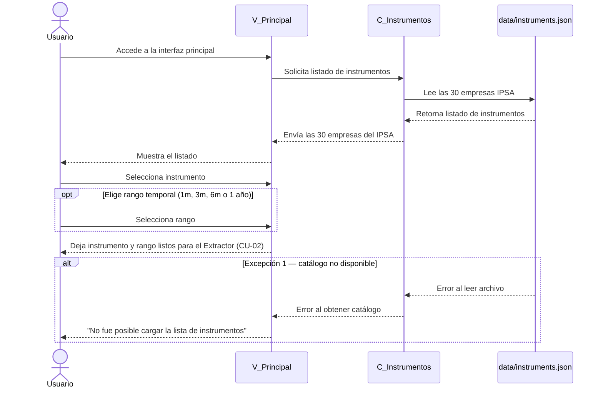
```mermaid
sequenceDiagram
    actor U as Usuario
    participant V as V_Principal
    participant CI as C_Instrumentos
    participant Cat as data/instruments.json
    U ->> V: Accede a la interfaz principal
    V ->> CI: Solicita listado de instrumentos
    CI ->> Cat: Lee las 30 empresas IPSA
    Cat -->> CI: Retorna listado de instrumentos
    CI -->> V: Envía las 30 empresas del IPSA
    V -->> U: Muestra el listado
    U ->> V: Selecciona instrumento
    opt Elige rango temporal (1m, 3m, 6m o 1 año)
        U ->> V: Selecciona rango
    end
    V -->> U: Deja instrumento y rango listos para el Extractor (CU-02)
    alt Excepción 1 — catálogo no disponible
        Cat -->> CI: Error al leer archivo
        CI -->> V: Error al obtener catálogo
        V -->> U: "No fue posible cargar la lista de instrumentos"
    end
```

**Notas**:
- **Origen del catálogo**: `data/instruments.json` es un archivo estático del proyecto (no vive en la BD). Se lee una sola vez al arrancar Flask y queda cargado en memoria en la constante `INSTRUMENTS`.
- **Sin BD**: CU-01 solo lista y selecciona; por eso el diagrama no incluye `C_SQLite` ni tablas.
- **Selección solo en el navegador**: al elegir instrumento y rango, el estado queda en el JS del navegador (`dashboard.js:selectInstrument`); no viaja al backend hasta que se dispara la primera consulta de indicador (CU-02).
- **Nombre `C_Instrumentos`**: agrupación funcional del propósito. En el código real es la ruta `api_instruments` del Blueprint `web`.

---

## CU-02: Extrayendo indicadores desde las APIs financieras

**Ruta / archivo**: `src/web/routes.py:api_query` → `_run_query` → `src/extractor/__init__.py:get_indicator` → `_get_history` → `src/extractor/sources.py:fetch_price_history` (`_retry` con `max_retries=3`).

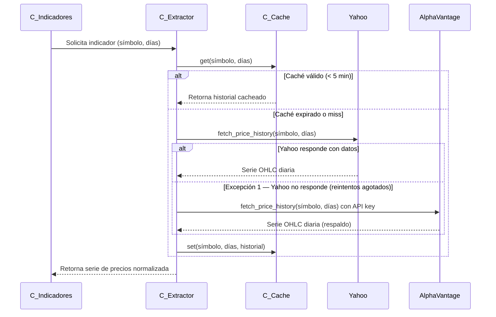
```mermaid
sequenceDiagram
    participant CI as C_Indicadores
    participant CE as C_Extractor
    participant CC as C_Cache
    participant Y as Yahoo
    participant AV as AlphaVantage
    CI ->> CE: Solicita indicador (símbolo, días)
    CE ->> CC: get(símbolo, días)
    alt Caché válido (< 5 min)
        CC -->> CE: Retorna historial cacheado
    else Caché expirado o miss
        CE ->> Y: fetch_price_history(símbolo, días)
        alt Yahoo responde con datos
            Y -->> CE: Serie OHLC diaria
        else Excepción 1 — Yahoo no responde (reintentos agotados)
            CE ->> AV: fetch_price_history(símbolo, días) con API key
            AV -->> CE: Serie OHLC diaria (respaldo)
        end
        CE ->> CC: set(símbolo, días, historial)
    end
    CE -->> CI: Retorna serie de precios normalizada
```

**Notas**: RNF-09.2 (`_retry` en `sources.py:45`) reintenta hasta 3 veces antes de propagar la falla. No toca la BD; la trazabilidad de la extracción se persiste en CU-03.

---

## CU-03: Registrando la trazabilidad de cada extracción

**Ruta / archivo**: `src/web/routes.py:_log_and_validate` — persiste `QueryLog` con `source`, `processing_time_ms` y `created_at`.

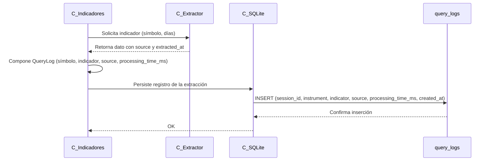
```mermaid
sequenceDiagram
    participant CI as C_Indicadores
    participant CE as C_Extractor
    participant CS as C_SQLite
    participant TQ as query_logs
    CI ->> CE: Solicita indicador (símbolo, días)
    CE -->> CI: Retorna dato con source y extracted_at
    CI ->> CI: Compone QueryLog (símbolo, indicador, source, processing_time_ms)
    CI ->> CS: Persiste registro de la extracción
    CS ->> TQ: INSERT (session_id, instrument, indicator, source, processing_time_ms, created_at)
    TQ -->> CS: Confirma inserción
    CS -->> CI: OK
```

**Notas**: la trazabilidad se registra siempre, tanto para consultas anónimas (sin `user_id`) como para autenticadas (con `user_id` no nulo).

---

## CU-04: Extrayendo indicadores macroeconómicos del Banco Central

**Ruta / archivo**: `src/web/routes.py:api_ticker` → `src/extractor/__init__.py:get_macro_indicators` → `src/extractor/sources.py:fetch_macro_indicators` (con reintentos).

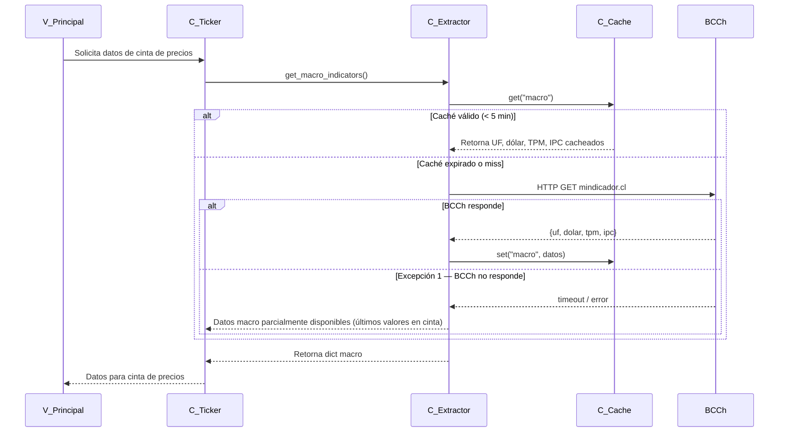
```mermaid
sequenceDiagram
    participant V as V_Principal
    participant CT as C_Ticker
    participant CE as C_Extractor
    participant CC as C_Cache
    participant B as BCCh
    V ->> CT: Solicita datos de cinta de precios
    CT ->> CE: get_macro_indicators()
    CE ->> CC: get("macro")
    alt Caché válido (< 5 min)
        CC -->> CE: Retorna UF, dólar, TPM, IPC cacheados
    else Caché expirado o miss
        CE ->> B: HTTP GET mindicador.cl
        alt BCCh responde
            B -->> CE: {uf, dolar, tpm, ipc}
            CE ->> CC: set("macro", datos)
        else Excepción 1 — BCCh no responde
            B -->> CE: timeout / error
            CE -->> CT: Datos macro parcialmente disponibles (últimos valores en cinta)
        end
    end
    CE -->> CT: Retorna dict macro
    CT -->> V: Datos para cinta de precios
```

**Notas**: la cinta también incluye IPSA + las 30 acciones vía `get_quotes` (Yahoo), pero eso corresponde al flujo de CU-16/CU-17.

---

## CU-05: Actualizando indicadores respetando los límites de la API

**Ruta / archivo**: `src/extractor/cache.py:TTLCache.get` (verificación TTL) + `src/extractor/sources.py:_retry` (3 reintentos por defecto).

> ⚠️ **Divergencia con la memoria**: la Excepción 1 de la tabla dice "el sistema entrega el último valor en caché disponible" cuando se alcanza el límite de la API. El código actual **no implementa** ese fallback stale-while-error: si la API falla tras los reintentos, se propaga `ExtractionError`. El diagrama refleja el código real.

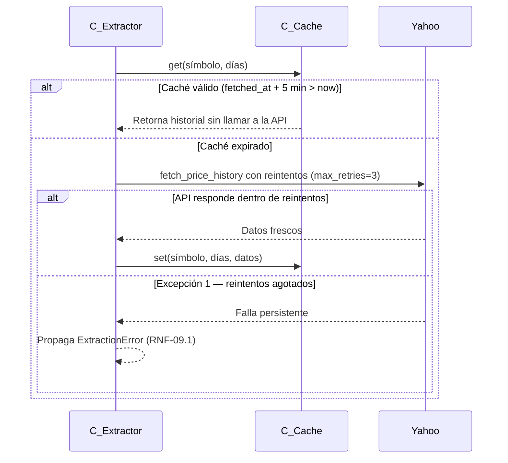
```mermaid
sequenceDiagram
    participant CE as C_Extractor
    participant CC as C_Cache
    participant Y as Yahoo
    CE ->> CC: get(símbolo, días)
    alt Caché válido (fetched_at + 5 min > now)
        CC -->> CE: Retorna historial sin llamar a la API
    else Caché expirado
        CE ->> Y: fetch_price_history con reintentos (max_retries=3)
        alt API responde dentro de reintentos
            Y -->> CE: Datos frescos
            CE ->> CC: set(símbolo, días, datos)
        else Excepción 1 — reintentos agotados
            Y -->> CE: Falla persistente
            CE -->> CE: Propaga ExtractionError (RNF-09.1)
        end
    end
```

**Notas**: la política de "respeto de rate limits" está implementada como caché de 5 minutos por `(símbolo, días)`. No hay contador global de llamadas por minuto.

---

## CU-06: Validando formato y rango de los indicadores extraídos

**Ruta / archivo**: `src/extractor/__init__.py:_validate_inputs` (valida `days`, `indicator`, `interval`) + `src/extractor/indicators.py:compute_indicator` (lanza `ValueError` si datos insuficientes).

> ⚠️ **Divergencia con la memoria**: la tabla describe validación por rango numérico específico ("RSI entre 0 y 100, %B entre 0 y 1, MACD y MAs finitos"). El código actual **no valida el rango del valor calculado**; solo valida el input (nombre del indicador, período, intervalo) y captura errores de cálculo cuando faltan datos. El diagrama refleja el código real.

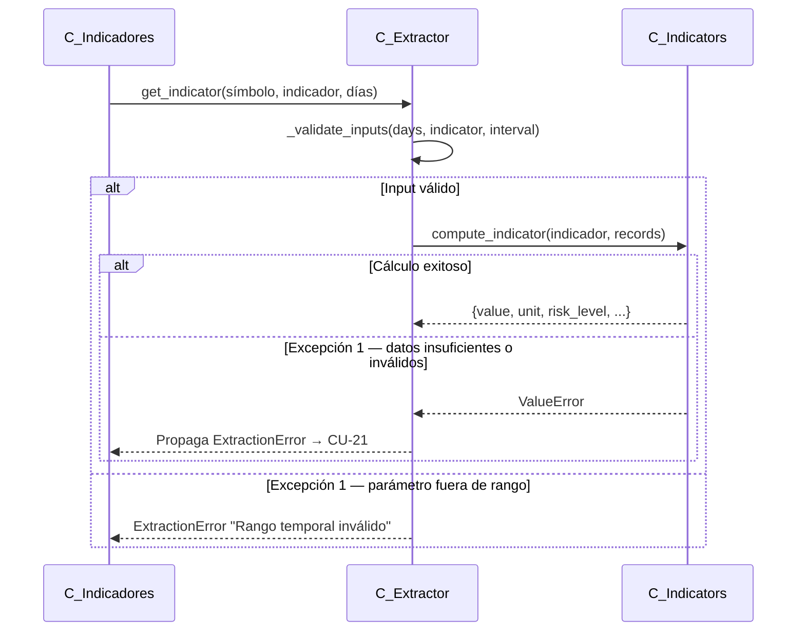
```mermaid
sequenceDiagram
    participant CI as C_Indicadores
    participant CE as C_Extractor
    participant CIn as C_Indicators
    CI ->> CE: get_indicator(símbolo, indicador, días)
    CE ->> CE: _validate_inputs(days, indicator, interval)
    alt Input válido
        CE ->> CIn: compute_indicator(indicador, records)
        alt Cálculo exitoso
            CIn -->> CE: {value, unit, risk_level, ...}
        else Excepción 1 — datos insuficientes o inválidos
            CIn -->> CE: ValueError
            CE -->> CI: Propaga ExtractionError → CU-21
        end
    else Excepción 1 — parámetro fuera de rango
        CE -->> CI: ExtractionError "Rango temporal inválido"
    end
```

**Notas**: `VALID_PERIODS = (30, 90, 180, 365)` e `INDICATOR_TYPES = ("rsi", "medias_moviles", "macd", "bandas_bollinger")` son las únicas validaciones estrictas del input. Cualquier value fuera de rango del propio indicador (por ejemplo RSI > 100) sería un bug de cálculo, no un caso a validar.

---

## CU-07: Normalizando los indicadores a una estructura común

**Ruta / archivo**: `src/extractor/sources.py:_fetch_yahoo` / `_fetch_alpha_vantage` (normalizan records a `{date, open, high, low, close}`) + `src/extractor/__init__.py:get_indicator` (agrega `symbol`, `source`, `extracted_at`, `period_days`).

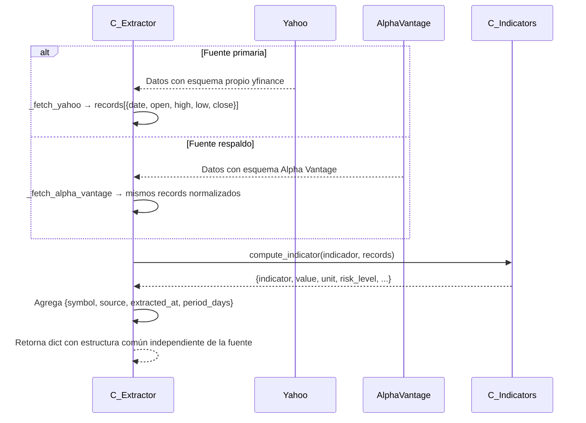
```mermaid
sequenceDiagram
    participant CE as C_Extractor
    participant Y as Yahoo
    participant AV as AlphaVantage
    participant CIn as C_Indicators
    alt Fuente primaria
        Y -->> CE: Datos con esquema propio yfinance
        CE ->> CE: _fetch_yahoo → records[{date, open, high, low, close}]
    else Fuente respaldo
        AV -->> CE: Datos con esquema Alpha Vantage
        CE ->> CE: _fetch_alpha_vantage → mismos records normalizados
    end
    CE ->> CIn: compute_indicator(indicador, records)
    CIn -->> CE: {indicator, value, unit, risk_level, ...}
    CE ->> CE: Agrega {symbol, source, extracted_at, period_days}
    CE -->> CE: Retorna dict con estructura común independiente de la fuente
```

**Notas**: la normalización tiene dos niveles — primero los records de precios (uniformes entre Yahoo y Alpha Vantage) y luego el dict de indicador (uniforme entre RSI, MACD, MAs y Bollinger).

---

## CU-08: Procesando el indicador mediante el modelo de lenguaje

**Ruta / archivo**: `src/nlp/explainer.py:generate_explanation` → `_finbert_signal` (carga `ProsusAI/finbert` vía `transformers.pipeline`).

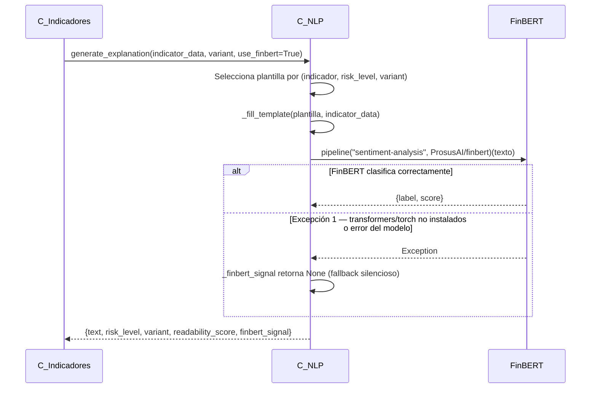
```mermaid
sequenceDiagram
    participant CI as C_Indicadores
    participant CN as C_NLP
    participant FB as FinBERT
    CI ->> CN: generate_explanation(indicator_data, variant, use_finbert=True)
    CN ->> CN: Selecciona plantilla por (indicador, risk_level, variant)
    CN ->> CN: _fill_template(plantilla, indicator_data)
    CN ->> FB: pipeline("sentiment-analysis", ProsusAI/finbert)(texto)
    alt FinBERT clasifica correctamente
        FB -->> CN: {label, score}
    else Excepción 1 — transformers/torch no instalados o error del modelo
        FB -->> CN: Exception
        CN ->> CN: _finbert_signal retorna None (fallback silencioso)
    end
    CN -->> CI: {text, risk_level, variant, readability_score, finbert_signal}
```

**Notas**: FinBERT está default-on desde el Bloque 2 del refactor (`USE_FINBERT=true`). El fallback silencioso mantiene el sistema operativo bajo RNF-09.

---

## CU-09: Validando la explicación generada contra el dato real

**Ruta / archivo**: `src/nlp/validator.py:validate_coherence` (invocado desde `src/web/routes.py:_log_and_validate`).

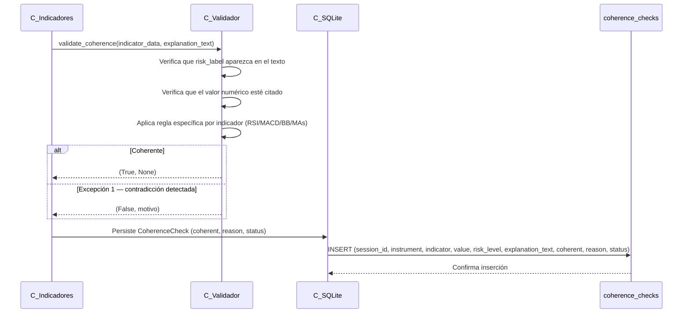
```mermaid
sequenceDiagram
    participant CI as C_Indicadores
    participant CV as C_Validador
    participant CS as C_SQLite
    participant TC as coherence_checks
    CI ->> CV: validate_coherence(indicator_data, explanation_text)
    CV ->> CV: Verifica que risk_label aparezca en el texto
    CV ->> CV: Verifica que el valor numérico esté citado
    CV ->> CV: Aplica regla específica por indicador (RSI/MACD/BB/MAs)
    alt Coherente
        CV -->> CI: (True, None)
    else Excepción 1 — contradicción detectada
        CV -->> CI: (False, motivo)
    end
    CI ->> CS: Persiste CoherenceCheck (coherent, reason, status)
    CS ->> TC: INSERT (session_id, instrument, indicator, value, risk_level, explanation_text, coherent, reason, status)
    TC -->> CS: Confirma inserción
```

**Notas**: los casos con `coherent=False` quedan como `status="pendiente"` para que la investigadora los revise vía CU-08 (Auditoría). Los coherentes se marcan como `status="revisado"` automáticamente.

---

## CU-10: Generando una explicación comprensible

**Ruta / archivo**: `src/nlp/explainer.py:generate_explanation` — selección de plantilla, llenado, referencia nacional, extra de detalle, truncado a MAX_WORDS, cálculo de legibilidad.

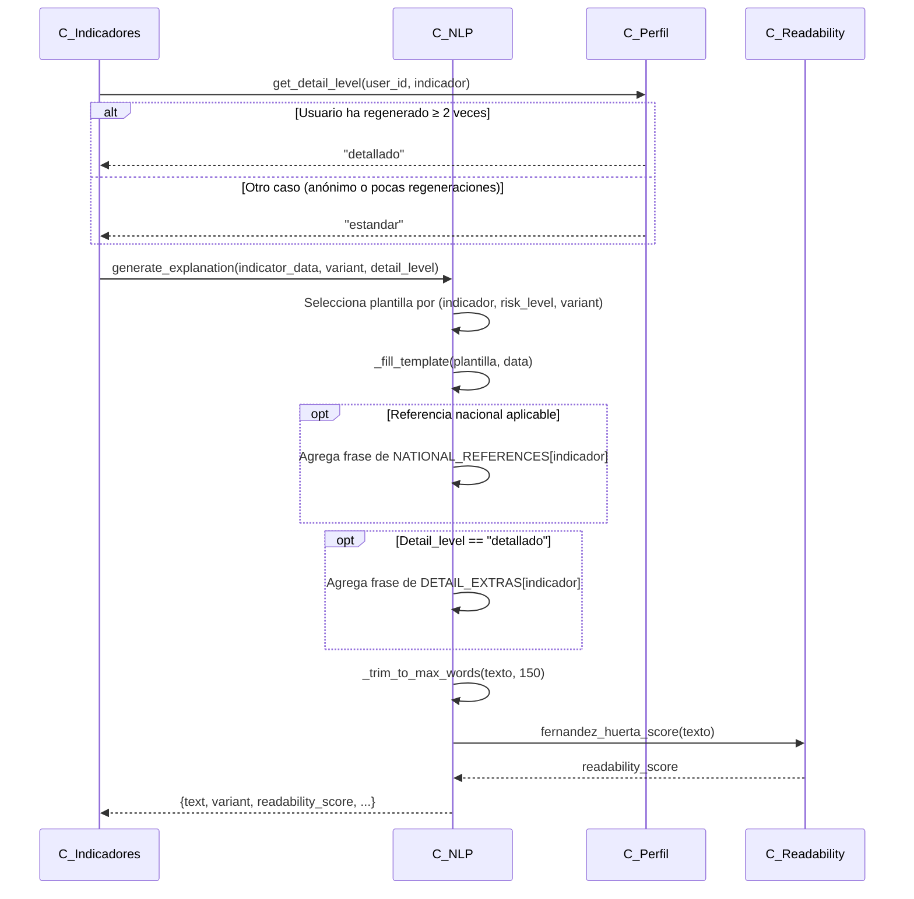
```mermaid
sequenceDiagram
    participant CI as C_Indicadores
    participant CN as C_NLP
    participant CP as C_Perfil
    participant CR as C_Readability
    CI ->> CP: get_detail_level(user_id, indicador)
    alt Usuario ha regenerado ≥ 2 veces
        CP -->> CI: "detallado"
    else Otro caso (anónimo o pocas regeneraciones)
        CP -->> CI: "estandar"
    end
    CI ->> CN: generate_explanation(indicator_data, variant, detail_level)
    CN ->> CN: Selecciona plantilla por (indicador, risk_level, variant)
    CN ->> CN: _fill_template(plantilla, data)
    opt Referencia nacional aplicable
        CN ->> CN: Agrega frase de NATIONAL_REFERENCES[indicador]
    end
    opt Detail_level == "detallado"
        CN ->> CN: Agrega frase de DETAIL_EXTRAS[indicador]
    end
    CN ->> CN: _trim_to_max_words(texto, 150)
    CN ->> CR: fernandez_huerta_score(texto)
    CR -->> CN: readability_score
    CN -->> CI: {text, variant, readability_score, ...}
```

**Notas**: RF-04.2 (extensión ≤ 150 palabras) se satisface por `_trim_to_max_words`. RNF-04.1 (legibilidad Fernández-Huerta) se calcula pero no se rechaza el texto si no cumple — solo se registra el score.

---

## Estado de implementación (CU-01 a CU-10)

| CU | Estado en el código | Notas |
|---|---|---|
| CU-01 | ✅ Implementado | Sin BD; flujo puramente UI |
| CU-02 | ✅ Implementado | Fallback Yahoo → Alpha Vantage funcional |
| CU-03 | ✅ Implementado | Persiste en `query_logs` |
| CU-04 | ✅ Implementado | Con degradación parcial si BCCh falla |
| CU-05 | ⚠️ Parcial | TTL 5 min sí; stale-while-error de la Excepción 1 **no** |
| CU-06 | ⚠️ Parcial | Valida input; **no** valida rango del valor calculado |
| CU-07 | ✅ Implementado | Doble normalización (records + dict indicador) |
| CU-08 | ✅ Implementado | FinBERT default-on con fallback silencioso |
| CU-09 | ✅ Implementado | Persiste `coherence_checks` con motivo |
| CU-10 | ✅ Implementado | Perfil adaptativo + plantillas + legibilidad |

---

## CU-11: Adaptando el nivel de detalle al usuario no experto

**Ruta / archivo**: `src/profile/service.py:get_detail_level` (consulta `query_logs`), invocado desde `src/web/routes.py:_run_query` antes de pasar `detail_level` al Procesador NLP. La adaptación efectiva la aplica `src/nlp/explainer.py:generate_explanation` agregando `DETAIL_EXTRAS[indicador]` si el nivel es "detallado".

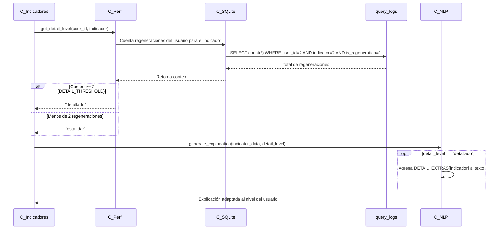
```mermaid
sequenceDiagram
    participant CI as C_Indicadores
    participant CP as C_Perfil
    participant CS as C_SQLite
    participant TQ as query_logs
    participant CN as C_NLP
    CI ->> CP: get_detail_level(user_id, indicador)
    CP ->> CS: Cuenta regeneraciones del usuario para el indicador
    CS ->> TQ: SELECT count(*) WHERE user_id=? AND indicator=? AND is_regeneration=1
    TQ -->> CS: total de regeneraciones
    CS -->> CP: Retorna conteo
    alt Conteo >= 2 (DETAIL_THRESHOLD)
        CP -->> CI: "detallado"
    else Menos de 2 regeneraciones
        CP -->> CI: "estandar"
    end
    CI ->> CN: generate_explanation(indicator_data, detail_level)
    opt detail_level == "detallado"
        CN ->> CN: Agrega DETAIL_EXTRAS[indicador] al texto
    end
    CN -->> CI: Explicación adaptada al nivel del usuario
```

**Notas**: para usuarios anónimos (`user_id` = None) el nivel es siempre "estandar" y no se consulta la BD.

---

## CU-12: Clasificando el nivel de riesgo del indicador

**Ruta / archivo**: `src/extractor/indicators.py:compute_rsi`, `compute_moving_averages`, `compute_macd`, `compute_bollinger_bands`. Cada función clasifica su propio `risk_level` a partir de umbrales internos (no depende del NLP).

> ⚠️ **Divergencia con la memoria**: la tabla dice "El sistema calcula la categoría de riesgo del indicador procesado a partir del ancho de las Bandas de Bollinger". En el código, **cada indicador clasifica su propio riesgo** con umbrales propios (RSI por sobrecompra/sobreventa, medias móviles por diferencia porcentual, MACD por magnitud del histograma vs desviación típica, Bollinger por %B). No hay una clasificación global que dependa del ancho de las Bandas.

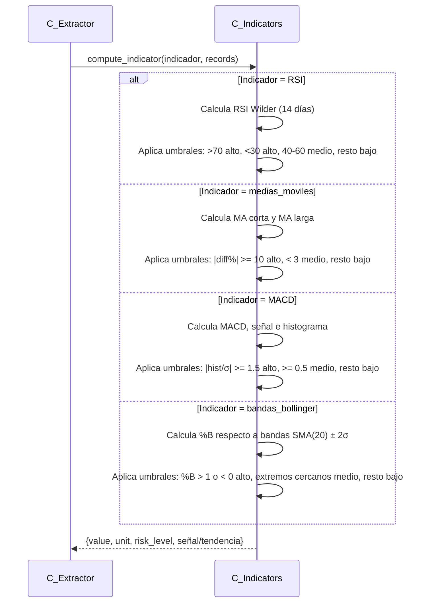
```mermaid
sequenceDiagram
    participant CE as C_Extractor
    participant CIn as C_Indicators
    CE ->> CIn: compute_indicator(indicador, records)
    alt Indicador = RSI
        CIn ->> CIn: Calcula RSI Wilder (14 días)
        CIn ->> CIn: Aplica umbrales: >70 alto, <30 alto, 40-60 medio, resto bajo
    else Indicador = medias_moviles
        CIn ->> CIn: Calcula MA corta y MA larga
        CIn ->> CIn: Aplica umbrales: |diff%| >= 10 alto, < 3 medio, resto bajo
    else Indicador = MACD
        CIn ->> CIn: Calcula MACD, señal e histograma
        CIn ->> CIn: Aplica umbrales: |hist/σ| >= 1.5 alto, >= 0.5 medio, resto bajo
    else Indicador = bandas_bollinger
        CIn ->> CIn: Calcula %B respecto a bandas SMA(20) ± 2σ
        CIn ->> CIn: Aplica umbrales: %B > 1 o < 0 alto, extremos cercanos medio, resto bajo
    end
    CIn -->> CE: {value, unit, risk_level, señal/tendencia}
```

**Notas**: la clasificación es determinística y por indicador. Se persiste en `QueryLog.risk_level` a través del flujo de CU-03.

---

## CU-13: Solicitando la regeneración de una explicación

**Ruta / archivo**: `src/web/routes.py:api_regenerate` (`POST /api/regenerate`), invocado desde `dashboard.js` al hacer clic en "No entendí esto". Reutiliza `_run_query` con `regenerate_explanation` y persiste otro `QueryLog` con `is_regeneration=True`.

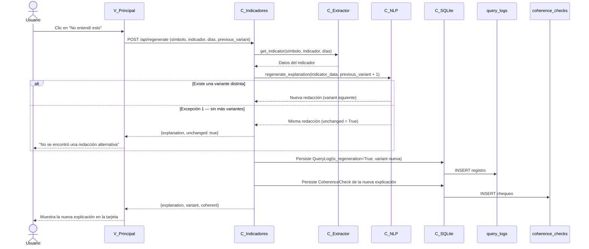
```mermaid
sequenceDiagram
    actor U as Usuario
    participant V as V_Principal
    participant CI as C_Indicadores
    participant CE as C_Extractor
    participant CN as C_NLP
    participant CS as C_SQLite
    participant TQ as query_logs
    participant TC as coherence_checks
    U ->> V: Clic en "No entendí esto"
    V ->> CI: POST /api/regenerate (símbolo, indicador, días, previous_variant)
    CI ->> CE: get_indicator(símbolo, indicador, días)
    CE -->> CI: Datos del indicador
    CI ->> CN: regenerate_explanation(indicator_data, previous_variant + 1)
    alt Existe una variante distinta
        CN -->> CI: Nueva redacción (variant siguiente)
    else Excepción 1 — sin más variantes
        CN -->> CI: Misma redacción (unchanged = True)
        CI -->> V: {explanation, unchanged: true}
        V -->> U: "No se encontró una redacción alternativa"
    end
    CI ->> CS: Persiste QueryLog(is_regeneration=True, variant nueva)
    CS ->> TQ: INSERT registro
    CI ->> CS: Persiste CoherenceCheck de la nueva explicación
    CS ->> TC: INSERT chequeo
    CI -->> V: {explanation, variant, coherent}
    V -->> U: Muestra la nueva explicación en la tarjeta
```

**Notas**: cada regeneración incrementa el conteo que alimenta CU-11 (a la próxima consulta el usuario recibirá el nivel "detallado" para ese indicador si acumula ≥ 2).

---

## CU-14: Accediendo a la interfaz web del sistema

**Ruta / archivo**: `src/web/routes.py:index` (`GET /`) renderiza `templates/index.html`.

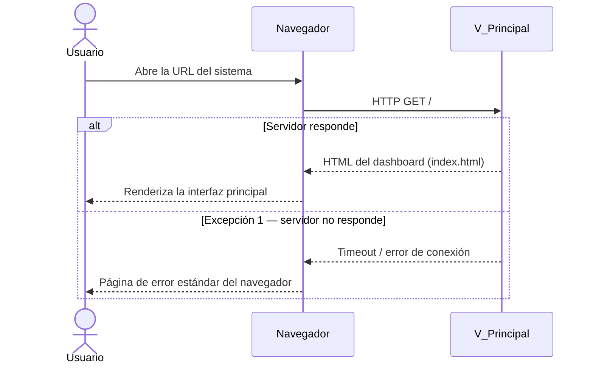
```mermaid
sequenceDiagram
    actor U as Usuario
    participant N as Navegador
    participant V as V_Principal
    U ->> N: Abre la URL del sistema
    N ->> V: HTTP GET /
    alt Servidor responde
        V -->> N: HTML del dashboard (index.html)
        N -->> U: Renderiza la interfaz principal
    else Excepción 1 — servidor no responde
        V -->> N: Timeout / error de conexión
        N -->> U: Página de error estándar del navegador
    end
```

**Notas**: no toca la BD ni servicios de dominio. Es la puerta de entrada a la aplicación; cualquier flujo posterior parte de aquí.

---

## CU-15: Seleccionando el indicador financiero a consultar

**Ruta / archivo**: `src/web/templates/index.html` define `APP_INDICATORS` (lista estática de los cuatro indicadores). `src/web/static/js/dashboard.js:loadIndicators` los recorre y dispara una llamada a `/api/query` por cada uno.

> ⚠️ **Divergencia con la memoria**: la tabla implica que el usuario **elige un indicador** de una lista antes de la consulta. En el código real, los **cuatro indicadores** (RSI, medias móviles, MACD, Bandas de Bollinger) se cargan automáticamente en paralelo al seleccionar un instrumento. No hay un paso donde el usuario seleccione un indicador específico entre varios.

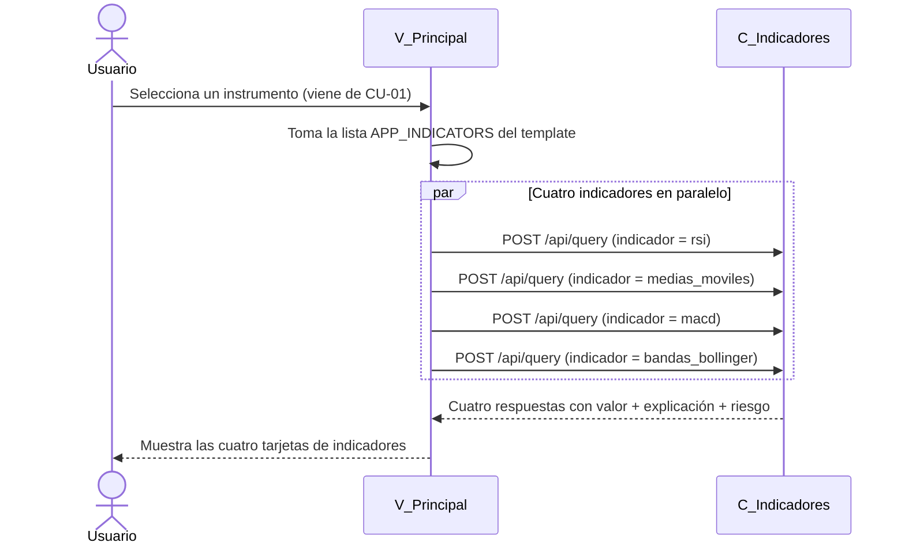
```mermaid
sequenceDiagram
    actor U as Usuario
    participant V as V_Principal
    participant CI as C_Indicadores
    U ->> V: Selecciona un instrumento (viene de CU-01)
    V ->> V: Toma la lista APP_INDICATORS del template
    par Cuatro indicadores en paralelo
        V ->> CI: POST /api/query (indicador = rsi)
        V ->> CI: POST /api/query (indicador = medias_moviles)
        V ->> CI: POST /api/query (indicador = macd)
        V ->> CI: POST /api/query (indicador = bandas_bollinger)
    end
    CI -->> V: Cuatro respuestas con valor + explicación + riesgo
    V -->> U: Muestra las cuatro tarjetas de indicadores
```

**Notas**: si se quisiera implementar la memoria fielmente, habría que agregar un selector de indicador único en la interfaz. El diseño actual privilegia mostrar los cuatro simultáneamente para no ocultar información.

---

## CU-16: Visualizando la cinta de precios

**Ruta / archivo**: `src/web/templates/base.html` incluye el div `#ticker-tape` y carga `static/js/ticker.js` en todas las páginas.

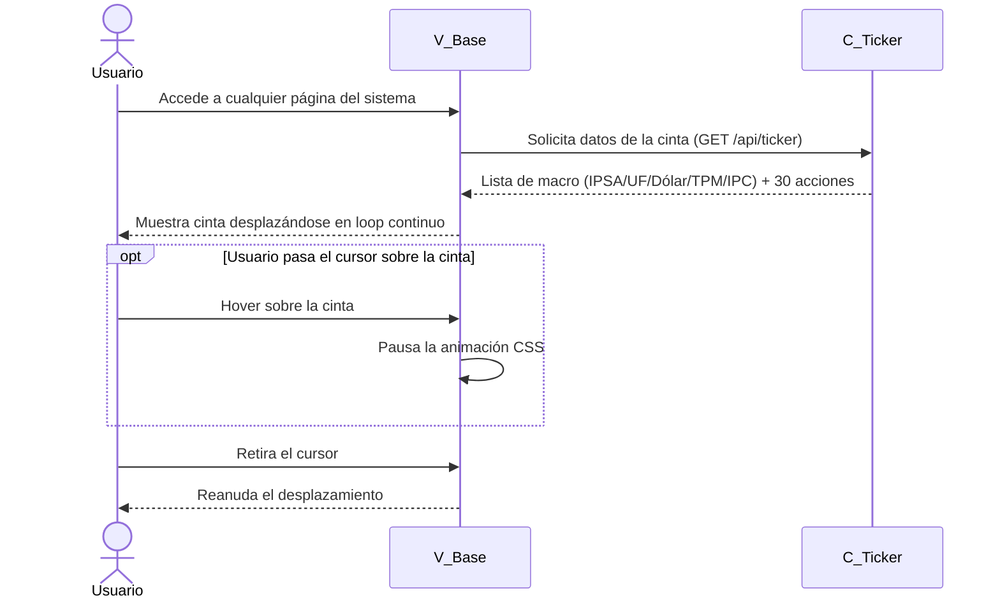
```mermaid
sequenceDiagram
    actor U as Usuario
    participant V as V_Base
    participant CT as C_Ticker
    U ->> V: Accede a cualquier página del sistema
    V ->> CT: Solicita datos de la cinta (GET /api/ticker)
    CT -->> V: Lista de macro (IPSA/UF/Dólar/TPM/IPC) + 30 acciones
    V -->> U: Muestra cinta desplazándose en loop continuo
    opt Usuario pasa el cursor sobre la cinta
        U ->> V: Hover sobre la cinta
        V ->> V: Pausa la animación CSS
    end
    U ->> V: Retira el cursor
    V -->> U: Reanuda el desplazamiento
```

**Notas**: es visualmente parte de todas las vistas porque vive en `base.html`. Los datos vienen del flujo detallado en CU-17.

---

## CU-17: Desplegando el contenido de la cinta de precios

**Ruta / archivo**: `src/web/routes.py:api_ticker` — combina `get_macro_indicators()` (mindicador.cl) con `get_quotes()` (Yahoo Finance, incluye IPSA + las 30 acciones).

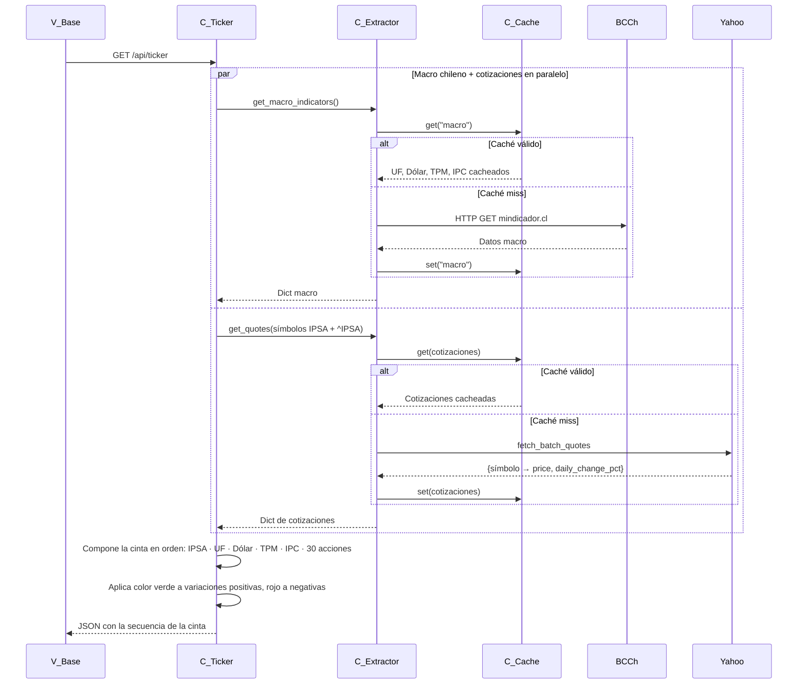
```mermaid
sequenceDiagram
    participant V as V_Base
    participant CT as C_Ticker
    participant CE as C_Extractor
    participant CC as C_Cache
    participant B as BCCh
    participant Y as Yahoo
    V ->> CT: GET /api/ticker
    par Macro chileno + cotizaciones en paralelo
        CT ->> CE: get_macro_indicators()
        CE ->> CC: get("macro")
        alt Caché válido
            CC -->> CE: UF, Dólar, TPM, IPC cacheados
        else Caché miss
            CE ->> B: HTTP GET mindicador.cl
            B -->> CE: Datos macro
            CE ->> CC: set("macro")
        end
        CE -->> CT: Dict macro
    and
        CT ->> CE: get_quotes(símbolos IPSA + ^IPSA)
        CE ->> CC: get(cotizaciones)
        alt Caché válido
            CC -->> CE: Cotizaciones cacheadas
        else Caché miss
            CE ->> Y: fetch_batch_quotes
            Y -->> CE: {símbolo → price, daily_change_pct}
            CE ->> CC: set(cotizaciones)
        end
        CE -->> CT: Dict de cotizaciones
    end
    CT ->> CT: Compone la cinta en orden: IPSA · UF · Dólar · TPM · IPC · 30 acciones
    CT ->> CT: Aplica color verde a variaciones positivas, rojo a negativas
    CT -->> V: JSON con la secuencia de la cinta
```

**Notas**: si BCCh no responde, la cinta muestra solo IPSA y las acciones (degradación tolerada por RNF-09). No toca BD.

---

## CU-18: Mostrando el valor original junto a la explicación

**Ruta / archivo**: `src/web/static/js/dashboard.js:renderCard` — arma el HTML de cada tarjeta con `data.value` y `data.explanation` que llegan del backend.

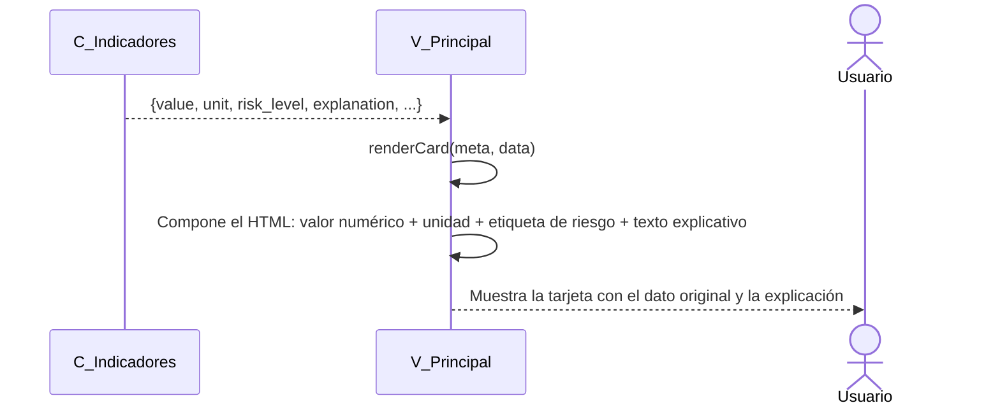
```mermaid
sequenceDiagram
    participant CI as C_Indicadores
    participant V as V_Principal
    actor U as Usuario
    CI -->> V: {value, unit, risk_level, explanation, ...}
    V ->> V: renderCard(meta, data)
    V ->> V: Compone el HTML: valor numérico + unidad + etiqueta de riesgo + texto explicativo
    V -->> U: Muestra la tarjeta con el dato original y la explicación
```

**Notas**: es puramente UI post-CU-02/CU-10. No toca BD ni servicios externos.

---

## CU-19: Mostrando la etiqueta de riesgo

**Ruta / archivo**: `src/web/static/js/dashboard.js:riskBadgeText`, `riskBadgeClass`. Mapea `risk_level` a texto + clase CSS.

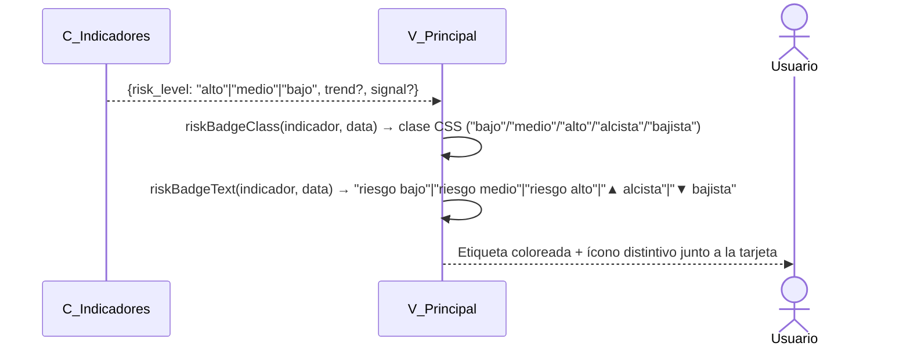
```mermaid
sequenceDiagram
    participant CI as C_Indicadores
    participant V as V_Principal
    actor U as Usuario
    CI -->> V: {risk_level: "alto"|"medio"|"bajo", trend?, signal?}
    V ->> V: riskBadgeClass(indicador, data) → clase CSS ("bajo"/"medio"/"alto"/"alcista"/"bajista")
    V ->> V: riskBadgeText(indicador, data) → "riesgo bajo"|"riesgo medio"|"riesgo alto"|"▲ alcista"|"▼ bajista"
    V -->> U: Etiqueta coloreada + ícono distintivo junto a la tarjeta
```

**Notas**: para medias móviles y MACD, la etiqueta refleja **tendencia** (alcista/bajista) en vez de nivel de riesgo. Cumple RF-08.2 (no depende solo del color: incluye ícono).

---

## CU-20: Mostrando el indicador de carga

**Ruta / archivo**: `src/web/static/js/dashboard.js:loadIndicators` maneja `#indicators-loading` y `#loading`. Se activa antes del `fetch` y se limpia en el `finally`.

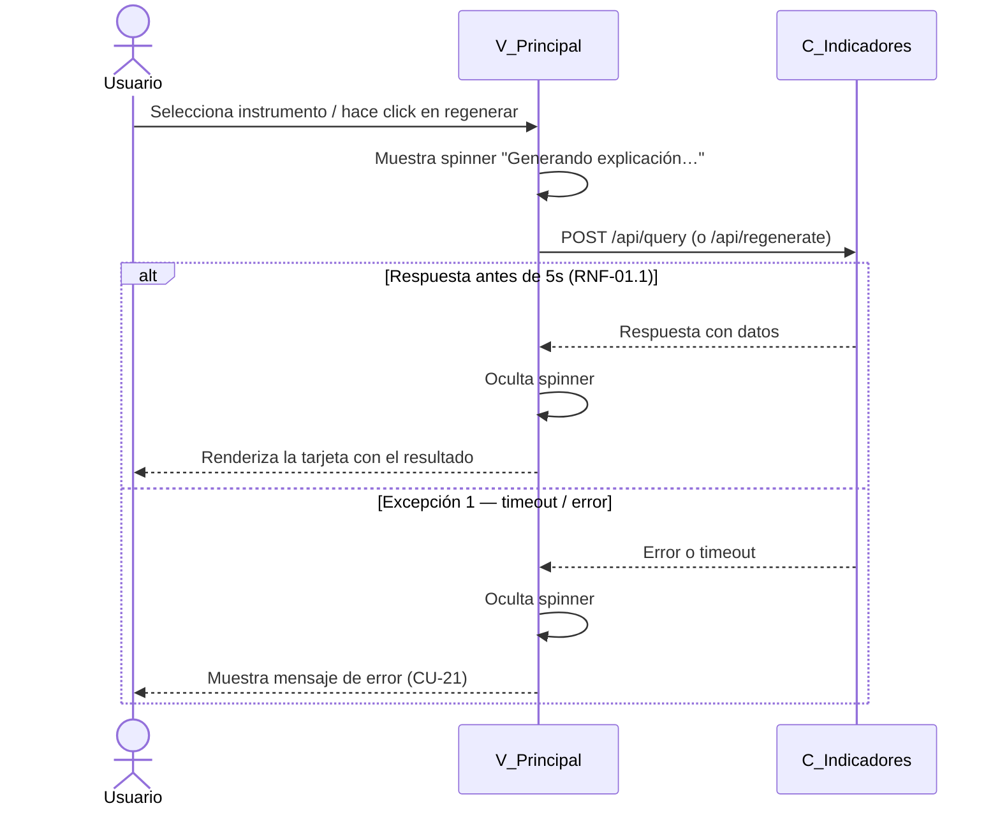
```mermaid
sequenceDiagram
    actor U as Usuario
    participant V as V_Principal
    participant CI as C_Indicadores
    U ->> V: Selecciona instrumento / hace click en regenerar
    V ->> V: Muestra spinner "Generando explicación…"
    V ->> CI: POST /api/query (o /api/regenerate)
    alt Respuesta antes de 5s (RNF-01.1)
        CI -->> V: Respuesta con datos
        V ->> V: Oculta spinner
        V -->> U: Renderiza la tarjeta con el resultado
    else Excepción 1 — timeout / error
        CI -->> V: Error o timeout
        V ->> V: Oculta spinner
        V -->> U: Muestra mensaje de error (CU-21)
    end
```

**Notas**: no persiste nada. El spinner es puramente UI.

---

## CU-21: Presentando un mensaje de error comprensible

**Ruta / archivo**: `src/web/routes.py` propaga `ExtractionError` como `{"error": mensaje}` con HTTP 502; `dashboard.js:showError` muestra el mensaje al usuario sin códigos HTTP.

```mermaid
sequenceDiagram
    actor U as Usuario
    participant V as V_Principal
    participant CI as C_Indicadores
    participant CE as C_Extractor
    V ->> CI: POST /api/query
    CI ->> CE: get_indicator(símbolo, indicador, días)
    alt Datos válidos
        CE -->> CI: Datos
        CI -->> V: {value, explanation, ...}
        V -->> U: Muestra la tarjeta
    else Excepción 1 — falla del Extractor tras reintentos (RNF-09.2)
        CE -->> CI: ExtractionError("No fue posible obtener el instrumento...")
        CI -->> V: {error: mensaje sin códigos HTTP}, status 502
        V ->> V: showError(mensaje)
        V -->> U: "No fue posible obtener el instrumento seleccionado. Intenta nuevamente en unos minutos."
    end
```

**Notas**: los mensajes están redactados sin jerga técnica ni códigos HTTP, coherente con RF-09.1.

---

## CU-22: Consultando el glosario de términos financieros

**Ruta / archivo**: `src/web/routes.py:glossary_page` (`GET /glosario`) y `api_glossary_search` (`GET /api/glosario/buscar`) → `src/nlp/glossary.py:list_terms`, `search_terms`. Los términos viven en `data/glossary.json`.

```mermaid
sequenceDiagram
    actor U as Usuario
    participant V as V_Glosario
    participant CG as C_Glosario
    participant Gl as data/glossary.json
    U ->> V: Accede a /glosario
    V ->> CG: Solicita listado completo
    CG ->> Gl: Lee términos y definiciones
    Gl -->> CG: Lista completa
    CG -->> V: Términos ordenados alfabéticamente
    V -->> U: Muestra el glosario
    opt Usuario busca un término
        U ->> V: Ingresa consulta en el campo de búsqueda
        V ->> CG: GET /api/glosario/buscar?q=...
        CG ->> Gl: Filtra por coincidencia en término o definición
        alt Existen coincidencias
            Gl -->> CG: Subconjunto de términos
            CG -->> V: Resultados filtrados
            V -->> U: Muestra las coincidencias
        else Excepción 1 — sin coincidencias
            Gl -->> CG: Lista vacía
            CG -->> V: []
            V -->> U: "No se encontraron resultados"
        end
    end
```

**Notas**: sin BD. El glosario también es un archivo estático como el catálogo de instrumentos.

---

## CU-23: Visualizando el historial de consultas

**Ruta / archivo**: `src/web/routes.py:history` (`GET /history`) lee `session.get("history", [])` (cookie Flask, RF-10.1). El historial se acumula desde `_push_history` en `/api/historial/visita`.

```mermaid
sequenceDiagram
    actor U as Usuario
    participant V as V_Historial
    participant CH as C_Historial
    participant SF as SesionFlask
    U ->> V: Accede a /history
    V ->> CH: Solicita historial de sesión
    CH ->> SF: session.get("history", [])
    SF -->> CH: Últimas 5 consultas de la sesión activa
    alt Existen consultas
        CH -->> V: Lista de {symbol, indicators, timestamp}
        V -->> U: Muestra últimas 5 consultas con fecha/hora
    else Excepción 1 — historial vacío
        CH -->> V: []
        V -->> U: "Aún no has realizado consultas en esta sesión"
    end
```

**Notas**: el historial vive en la **cookie de sesión Flask**, no en la BD. Se limita a `HISTORY_MAX_ITEMS = 5` (RF-10.1) y se pierde al cerrar el navegador. Por eso no aparecen ni `C_SQLite` ni tabla.

---

## CU-24: Registrando cuenta de usuario

**Ruta / archivo**: `src/auth/routes.py:api_register` (`POST /api/auth/registro`) → `src/auth/service.py:register_user` → INSERT en `users`.

```mermaid
sequenceDiagram
    actor U as Usuario
    participant V as V_Registro
    participant CA as C_Autenticacion
    participant CS as C_SQLite
    participant TU as users
    U ->> V: Completa correo + contraseña + (opcional) casillero de consentimiento
    V ->> CA: POST /api/auth/registro
    CA ->> CA: Valida formato de correo y largo mínimo de contraseña (>= 8)
    CA ->> CS: Verifica que el correo no exista
    CS ->> TU: SELECT WHERE email = ?
    TU -->> CS: Vacío
    CS -->> CA: OK
    CA ->> CA: Hashea la contraseña con Flask-Bcrypt
    CA ->> CS: INSERT usuario (username, email, password_hash, acepta_evaluacion)
    CS ->> TU: INSERT registro
    TU -->> CS: OK
    CA ->> CA: Genera JWT y lo pone en cookie httpOnly
    CA -->> V: 201 Created + cookies (access + csrf)
    V -->> U: Redirige al dashboard con sesión iniciada
    alt Excepción 1 — correo ya registrado
        TU -->> CS: Usuario existente
        CS -->> CA: Conflicto
        CA -->> V: 409 "Ese correo ya está registrado"
        V -->> U: "Ese correo ya está registrado. Inicia sesión"
    end
```

**Notas**: el registro deja al usuario autenticado sin pedir un login adicional (RF-11 mejorado). El consentimiento a evaluación se registra opcionalmente en `users.acepta_evaluacion` (movido desde el banner al registro en el Bloque 3 del refactor).

---

## CU-25: Iniciando y cerrando sesión

**Ruta / archivo**: `src/auth/routes.py:api_login` (`POST /api/auth/login`), `api_logout` (`POST /api/auth/logout`) → `src/auth/service.py:authenticate_user`. El logout persiste el `jti` del token en `revoked_tokens`.

```mermaid
sequenceDiagram
    actor U as Usuario
    participant V as V_Login
    participant CA as C_Autenticacion
    participant CS as C_SQLite
    participant TU as users
    participant TR as revoked_tokens
    U ->> V: Ingresa correo y contraseña
    V ->> CA: POST /api/auth/login
    CA ->> CS: Busca usuario por correo
    CS ->> TU: SELECT WHERE email = ?
    TU -->> CS: Retorna usuario y password_hash
    CS -->> CA: Retorna registro
    alt Credenciales correctas
        CA ->> CA: bcrypt.check_password_hash(hash, contraseña)
        CA ->> CA: Genera JWT (expira en 24h)
        CA -->> V: 200 OK + cookies (access + csrf)
        V -->> U: Sesión iniciada
    else Excepción 1 — credenciales incorrectas
        CA -->> V: 401 "Correo o contraseña incorrectos"
        V -->> U: Mensaje genérico (no revela cuál falló)
    end
    opt Usuario cierra sesión
        U ->> V: Clic en "Cerrar sesión"
        V ->> CA: POST /api/auth/logout
        CA ->> CS: Revoca el jti actual
        CS ->> TR: INSERT (jti, revoked_at)
        CA -->> V: 200 OK + limpia cookies
        V -->> U: Sesión cerrada
    end
```

**Notas**: revocación de tokens (`revoked_tokens`) satisface RF-17.3. Después del logout, cualquier reuso del JWT rechaza la petición.

---

## CU-26: Recuperando el perfil de aprendizaje al iniciar sesión

**Ruta / archivo**: `src/profile/routes.py:profile_page` (`GET /perfil`) → `src/profile/service.py:build_learning_profile`.

> ⚠️ **Divergencia con la memoria**: la tabla dice "al autenticarse, el sistema recupera el perfil". En el código real el perfil **no se carga en el login**; se computa **on-demand** cuando el usuario visita `/perfil`. El JWT solo transporta `identity=str(user.id)`; el perfil es dinámico. El diagrama refleja el código real.

```mermaid
sequenceDiagram
    actor U as Usuario
    participant V as V_Perfil
    participant CP as C_Perfil
    participant CS as C_SQLite
    participant TIV as instrument_visits
    participant TQ as query_logs
    U ->> V: Accede a /perfil (autenticado)
    V ->> CP: build_learning_profile(user_id)
    par Consultas paralelas al esquema
        CP ->> CS: Cuenta visitas del usuario
        CS ->> TIV: SELECT count(*) WHERE user_id = ?
        TIV -->> CS: total visitas
        CS -->> CP: N
    and
        CP ->> CS: Cuenta regeneraciones del usuario
        CS ->> TQ: SELECT count(*) WHERE user_id=? AND is_regeneration=1
        TQ -->> CS: total regeneraciones
        CS -->> CP: M
    and
        CP ->> CS: Top instrumentos visitados
        CS ->> TIV: SELECT instrument, count(*) GROUP BY instrument
        TIV -->> CS: Ranking de 5
        CS -->> CP: Lista ordenada
    and
        CP ->> CS: Ranking de regeneraciones por indicador
        CS ->> TQ: SELECT indicator, count(*) GROUP BY indicator WHERE is_regeneration=1
        TQ -->> CS: Ranking
        CS -->> CP: Lista ordenada
    end
    CP -->> V: Perfil consolidado
    V -->> U: Muestra "Mi perfil" con todas las métricas
```

**Notas**: cada visita a `/perfil` recalcula. No hay caché del perfil ni carga en el login.

---

## CU-27: Ajustando explicaciones según el perfil de aprendizaje

**Ruta / archivo**: `src/profile/service.py:get_detail_level` invocado desde `src/web/routes.py:api_query`. Ver también CU-11 (mismo mecanismo).

```mermaid
sequenceDiagram
    actor U as Usuario
    participant V as V_Principal
    participant CI as C_Indicadores
    participant CP as C_Perfil
    participant CS as C_SQLite
    participant TQ as query_logs
    participant CN as C_NLP
    U ->> V: Consulta un indicador (autenticado)
    V ->> CI: POST /api/query
    CI ->> CP: get_detail_level(user_id, indicador)
    CP ->> CS: Cuenta regeneraciones previas para (usuario, indicador)
    CS ->> TQ: SELECT count(*) WHERE user_id=? AND indicator=? AND is_regeneration=1
    TQ -->> CS: total
    CS -->> CP: Retorna conteo
    alt Conteo >= 2
        CP -->> CI: "detallado"
    else
        CP -->> CI: "estandar"
    end
    CI ->> CN: generate_explanation(indicator_data, detail_level)
    CN -->> CI: Texto adaptado
    CI -->> V: Respuesta con explicación ajustada al perfil
    V -->> U: Tarjeta con nivel de detalle acorde al historial
```

**Notas**: complementa a CU-11 desde la perspectiva del sistema completo. La diferencia entre ambos CU es sutil en la memoria; en el código es exactamente el mismo mecanismo (`get_detail_level`).

---

## CU-28: Visualizando el indicador más regenerado

**Ruta / archivo**: `src/profile/service.py:build_learning_profile` — bloque `regeneration_rows` calcula `top_indicator` = indicador con más regeneraciones del usuario.

```mermaid
sequenceDiagram
    actor U as Usuario
    participant V as V_Perfil
    participant CP as C_Perfil
    participant CS as C_SQLite
    participant TQ as query_logs
    U ->> V: Accede a /perfil
    V ->> CP: build_learning_profile(user_id)
    CP ->> CS: Ranking de indicadores regenerados
    CS ->> TQ: SELECT indicator, count(*) WHERE user_id=? AND is_regeneration=1 GROUP BY indicator ORDER BY count DESC
    TQ -->> CS: Filas ordenadas
    CS -->> CP: Lista de rankings
    alt Existen regeneraciones
        CP -->> V: top_indicator + count
        V -->> U: Muestra "Indicador que más te ha costado: MACD (3 regeneraciones)"
    else Excepción 1 — sin regeneraciones aún
        CP -->> V: top_indicator = None
        V -->> U: "Aún no hay datos suficientes"
    end
```

---

## CU-29: Visualizando los instrumentos más consultados

**Ruta / archivo**: `src/profile/service.py:build_learning_profile` — bloque `top_instruments_rows`.

```mermaid
sequenceDiagram
    actor U as Usuario
    participant V as V_Perfil
    participant CP as C_Perfil
    participant CS as C_SQLite
    participant TIV as instrument_visits
    U ->> V: Accede a /perfil
    V ->> CP: build_learning_profile(user_id)
    CP ->> CS: Top 5 instrumentos visitados
    CS ->> TIV: SELECT instrument, count(*) WHERE user_id=? GROUP BY instrument ORDER BY count DESC LIMIT 5
    TIV -->> CS: Ranking
    CS -->> CP: Lista top_instruments
    alt Existen visitas
        CP -->> V: [{instrument, count}, ...]
        V -->> U: Muestra ranking con cinco instrumentos y sus totales
    else Excepción 1 — sin visitas previas
        CP -->> V: []
        V -->> U: "Aún no has consultado ningún instrumento"
    end
```

---

## CU-30: Visualizando el total de consultas realizadas

**Ruta / archivo**: `src/profile/service.py:build_learning_profile` — `total_queries = visit_count + regeneration_count` (RF-19.3).

```mermaid
sequenceDiagram
    actor U as Usuario
    participant V as V_Perfil
    participant CP as C_Perfil
    participant CS as C_SQLite
    participant TIV as instrument_visits
    participant TQ as query_logs
    U ->> V: Accede a /perfil
    V ->> CP: build_learning_profile(user_id)
    par Dos conteos en paralelo
        CP ->> CS: Total de visitas del usuario
        CS ->> TIV: SELECT count(*) WHERE user_id = ?
        TIV -->> CS: visit_count
        CS -->> CP: N
    and
        CP ->> CS: Total de regeneraciones del usuario
        CS ->> TQ: SELECT count(*) WHERE user_id=? AND is_regeneration=1
        TQ -->> CS: regeneration_count
        CS -->> CP: M
    end
    CP ->> CP: total_queries = visit_count + regeneration_count
    CP -->> V: total_queries
    V -->> U: Muestra "Consultas totales: 12" (RF-19.3)
```

**Notas**: la memoria pide contar "consultas totales" como acciones del usuario, no `QueryLog` bruto (que se infla por las 4 llamadas paralelas por indicador). El cálculo `visit + regeneración` respeta esa intención.

---

## CU-31: Presentando la explicación del indicador más difícil

**Ruta / archivo**: `src/profile/service.py:build_learning_profile` — al identificar `top_indicator`, además busca el último `QueryLog` para ese indicador y devuelve `top_indicator_explanation` con su texto.

```mermaid
sequenceDiagram
    actor U as Usuario
    participant V as V_Perfil
    participant CP as C_Perfil
    participant CS as C_SQLite
    participant TQ as query_logs
    U ->> V: Accede a /perfil
    V ->> CP: build_learning_profile(user_id)
    CP ->> CS: Identifica top_indicator (ver CU-28)
    CS ->> TQ: SELECT indicator, count(*) ... ORDER BY count DESC
    TQ -->> CS: Ranking
    CS -->> CP: top_indicator = "macd" (ejemplo)
    CP ->> CS: Último QueryLog del usuario para top_indicator
    CS ->> TQ: SELECT * WHERE user_id=? AND indicator=? ORDER BY created_at DESC LIMIT 1
    TQ -->> CS: Fila más reciente
    CS -->> CP: Instrumento, explanation_text, variant
    CP -->> V: {top_indicator, explicación adaptada, instrumento asociado}
    V -->> U: Muestra tarjeta destacada del "indicador que más te ha costado"
```

**Notas**: reutiliza la última explicación persistida — no vuelve a llamar al Procesador NLP en la visita al perfil. La regeneración desde el perfil está en CU-32.

---

## CU-32: Reutilizando la última explicación generada

**Ruta / archivo**: `src/profile/routes.py:api_profile_regenerate` (`POST /api/perfil/regenerar`). Cuando el usuario pide una nueva explicación, se llama a `get_indicator` + `generate_explanation` con `variant = last_log.variant + 1` y `detail_level = "detallado"`; el resultado se persiste como un nuevo `QueryLog` con `is_regeneration=True`.

```mermaid
sequenceDiagram
    actor U as Usuario
    participant V as V_Perfil
    participant CP as C_Perfil
    participant CS as C_SQLite
    participant TQ as query_logs
    participant CE as C_Extractor
    participant CN as C_NLP
    U ->> V: Abre /perfil
    V ->> CP: build_learning_profile(user_id)
    CP ->> CS: Última explicación del top_indicator
    CS ->> TQ: SELECT explanation_text, variant WHERE user_id=? AND indicator=? ORDER BY created_at DESC LIMIT 1
    TQ -->> CS: Texto persistido
    CS -->> CP: Última explicación disponible
    CP -->> V: Reutiliza texto (no invoca al NLP)
    V -->> U: Muestra la explicación cacheada del indicador más difícil
    opt Usuario pide explícitamente regenerar (RF-14.5)
        U ->> V: Clic en "Explicar de otra forma"
        V ->> CP: POST /api/perfil/regenerar
        CP ->> CS: Recupera last_log del top_indicator
        CS ->> TQ: SELECT * ORDER BY created_at DESC LIMIT 1
        TQ -->> CS: last_log
        CS -->> CP: variant, instrument
        CP ->> CE: get_indicator(instrument, top_indicator, días=180)
        CE -->> CP: Datos frescos
        CP ->> CN: generate_explanation(data, variant + 1, detail_level="detallado")
        CN -->> CP: Nueva redacción
        CP ->> CS: Persiste QueryLog(is_regeneration=True, variant nueva)
        CS ->> TQ: INSERT
        CP -->> V: {explanation, indicator, instrument}
        V -->> U: Reemplaza la tarjeta con la nueva explicación
    end
```

**Notas**: la reutilización silenciosa evita cargar al Procesador NLP en cada visita al perfil (optimización descrita en RF-14.5). El usuario tiene el escape explícito de "regenerar" si el texto ya no le sirve.

---

## Estado de implementación (CU-11 a CU-32)

| CU | Estado en el código | Notas |
|---|---|---|
| CU-11 | ✅ Implementado | `get_detail_level` + `DETAIL_EXTRAS` |
| CU-12 | ⚠️ Parcial | La clasificación NO depende del ancho de Bandas de Bollinger como dice la memoria; cada indicador tiene sus propios umbrales |
| CU-13 | ✅ Implementado | `/api/regenerate` funcional |
| CU-14 | ✅ Implementado | Ruta `/` con `index.html` |
| CU-15 | ⚠️ Parcial | El usuario NO elige un indicador entre varios; los 4 se cargan en paralelo automáticamente |
| CU-16 | ✅ Implementado | Cinta visible en `base.html` |
| CU-17 | ✅ Implementado | Composición desde `api_ticker` con macro + cotizaciones |
| CU-18 | ✅ Implementado | UI de tarjeta con valor y explicación |
| CU-19 | ✅ Implementado | Etiqueta con texto + ícono + color |
| CU-20 | ✅ Implementado | Spinner de carga |
| CU-21 | ✅ Implementado | Mensajes sin códigos HTTP |
| CU-22 | ✅ Implementado | Glosario desde `data/glossary.json` |
| CU-23 | ✅ Implementado | Historial en cookie de sesión (no BD) |
| CU-24 | ✅ Implementado | Registro con consentimiento opcional |
| CU-25 | ✅ Implementado | Login/logout con revocación de token |
| CU-26 | ⚠️ Parcial | El perfil NO se carga al login; se computa on-demand al visitar `/perfil` |
| CU-27 | ✅ Implementado | Mismo mecanismo que CU-11 |
| CU-28 | ✅ Implementado | Ranking de regeneraciones por indicador |
| CU-29 | ✅ Implementado | Top 5 instrumentos visitados |
| CU-30 | ✅ Implementado | `visit + regeneración` según RF-19.3 |
| CU-31 | ✅ Implementado | Reutiliza `explanation_text` del último `QueryLog` |
| CU-32 | ✅ Implementado | Regeneración explícita vía `/api/perfil/regenerar` |
