# Diagramas de secuencia — appfint (CU-01 a CU-32)

Un diagrama de secuencia por cada caso de uso extendido de la memoria (`f1_s08xcortes.docx`, tablas 4.1 a 4.32). Los flujos se verificaron contra el código real de `src/`; cuando el código diverge de la tabla, se indica explícitamente con el marcador ⚠️.

**Convenciones de nombres** (aplicadas a todos los diagramas):

- Vistas con prefijo `V_` (por ejemplo `V_Principal`, `V_Login`).
- Controladores con prefijo `C_` (por ejemplo `C_Indicadores`, `C_Autenticacion`).
- Controlador de base de datos `C_SQLite` — solo se incluye si el caso de uso realmente accede a la BD.
- Tablas con su nombre real del esquema (`users`, `query_logs`, `survey_responses`, `coherence_checks`, `evaluation_sessions`, `instrument_visits`, `revoked_tokens`).
- Servicios externos con su nombre real: `Yahoo`, `AlphaVantage`, `BCCh` (mindicador.cl).
- Los mensajes están redactados en lenguaje de negocio (no en nombres de funciones del código), para que el diagrama se lea sin conocer la implementación.
- Mensajes de ida con `->>` y de retorno con `-->>`. Flujos opcionales en bloque `opt`, excepciones en bloque `alt`. Auto-llamadas con `Componente ->> Componente`.

---

## CU-01: Seleccionando instrumento y rango temporal

**Ruta / archivo**: `src/web/routes.py:index` (renderiza `index.html`), `src/web/routes.py:api_instruments` (`GET /api/instruments` — mapeado como `C_Instrumentos`), `src/web/static/js/dashboard.js` (selección UI). Las 30 acciones IPSA se cargan desde `data/instruments.json` al arrancar Flask y viven en la constante `INSTRUMENTS`. La cotización (precio + variación) corresponde a CU-16/CU-17.

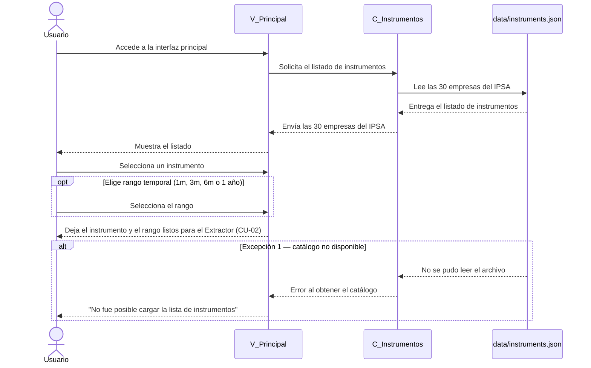
```mermaid
sequenceDiagram
    actor U as Usuario
    participant V as V_Principal
    participant CI as C_Instrumentos
    participant Cat as data/instruments.json
    U ->> V: Accede a la interfaz principal
    V ->> CI: Solicita el listado de instrumentos
    CI ->> Cat: Lee las 30 empresas del IPSA
    Cat -->> CI: Entrega el listado de instrumentos
    CI -->> V: Envía las 30 empresas del IPSA
    V -->> U: Muestra el listado
    U ->> V: Selecciona un instrumento
    opt Elige rango temporal (1m, 3m, 6m o 1 año)
        U ->> V: Selecciona el rango
    end
    V -->> U: Deja el instrumento y el rango listos para el Extractor (CU-02)
    alt Excepción 1 — catálogo no disponible
        Cat -->> CI: No se pudo leer el archivo
        CI -->> V: Error al obtener el catálogo
        V -->> U: "No fue posible cargar la lista de instrumentos"
    end
```

**Notas**:
- **Origen del catálogo**: `data/instruments.json` es un archivo estático del proyecto (no vive en la BD). Se lee una sola vez al arrancar Flask y queda cargado en memoria en la constante `INSTRUMENTS`.
- **Sin BD**: CU-01 solo lista y selecciona; por eso el diagrama no incluye `C_SQLite` ni tablas.
- **Selección solo en el navegador**: al elegir instrumento y rango, el estado queda en el JS del navegador (`dashboard.js:selectInstrument`); no viaja al backend hasta que se dispara la primera consulta de indicador (CU-02).
- **Nombre `C_Instrumentos`**: agrupación funcional del propósito. En el código real es la ruta `api_instruments` del Blueprint `web`.

---

## CU-02: Extrayendo indicadores desde las APIs financieras

**Ruta / archivo**: `src/web/routes.py:api_query` → `_run_query` → `src/extractor/__init__.py:get_indicator` → `_get_history` → `src/extractor/sources.py:fetch_price_history` (`_retry` con `max_retries=3`).

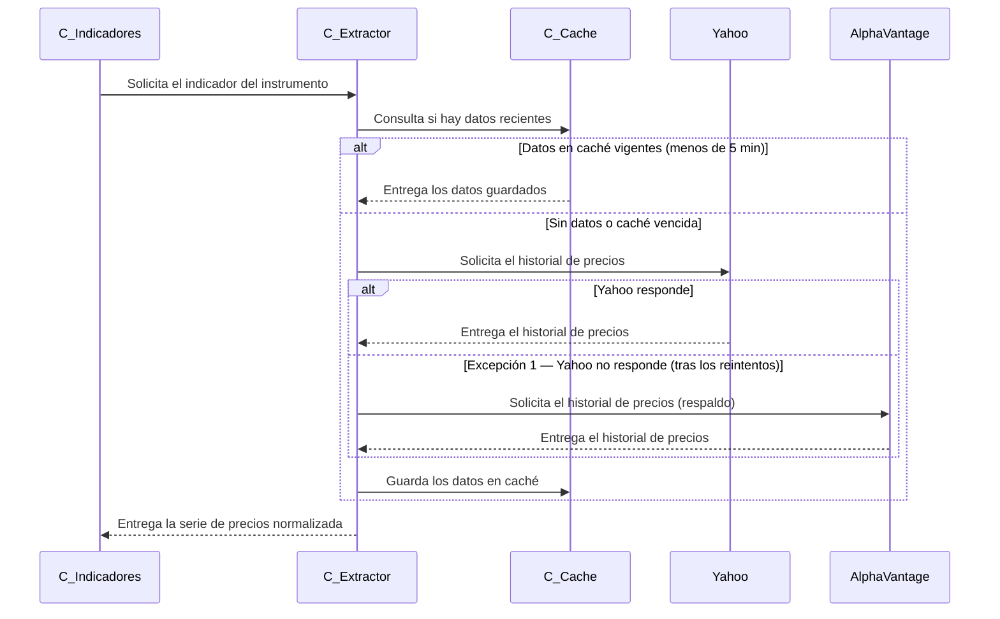
```mermaid
sequenceDiagram
    participant CI as C_Indicadores
    participant CE as C_Extractor
    participant CC as C_Cache
    participant Y as Yahoo
    participant AV as AlphaVantage
    CI ->> CE: Solicita el indicador del instrumento
    CE ->> CC: Consulta si hay datos recientes
    alt Datos en caché vigentes (menos de 5 min)
        CC -->> CE: Entrega los datos guardados
    else Sin datos o caché vencida
        CE ->> Y: Solicita el historial de precios
        alt Yahoo responde
            Y -->> CE: Entrega el historial de precios
        else Excepción 1 — Yahoo no responde (tras los reintentos)
            CE ->> AV: Solicita el historial de precios (respaldo)
            AV -->> CE: Entrega el historial de precios
        end
        CE ->> CC: Guarda los datos en caché
    end
    CE -->> CI: Entrega la serie de precios normalizada
```

**Notas**: RNF-09.2 (`_retry` en `sources.py:45`) reintenta hasta 3 veces antes de propagar la falla. No toca la BD; la trazabilidad de la extracción se persiste en CU-03.

---

## CU-03: Registrando la trazabilidad de cada extracción

**Ruta / archivo**: `src/web/routes.py:_log_and_validate` — persiste `QueryLog` con `source`, `processing_time_ms` y `created_at`.

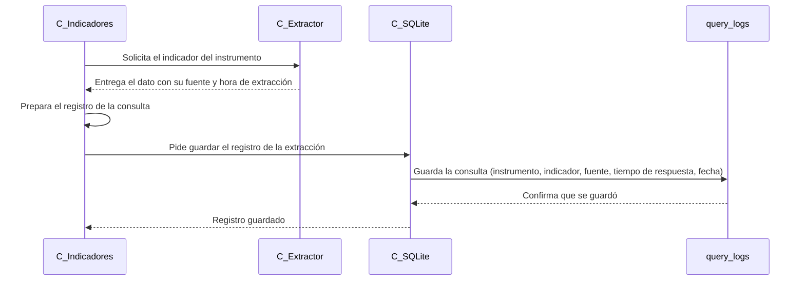
```mermaid
sequenceDiagram
    participant CI as C_Indicadores
    participant CE as C_Extractor
    participant CS as C_SQLite
    participant TQ as query_logs
    CI ->> CE: Solicita el indicador del instrumento
    CE -->> CI: Entrega el dato con su fuente y hora de extracción
    CI ->> CI: Prepara el registro de la consulta
    CI ->> CS: Pide guardar el registro de la extracción
    CS ->> TQ: Guarda la consulta (instrumento, indicador, fuente, tiempo de respuesta, fecha)
    TQ -->> CS: Confirma que se guardó
    CS -->> CI: Registro guardado
```

**Notas**: la trazabilidad se registra siempre, tanto para consultas anónimas (sin `user_id`) como para autenticadas (con `user_id` no nulo).

---

## CU-04: Extrayendo indicadores macroeconómicos del Banco Central

**Ruta / archivo**: `src/web/routes.py:api_ticker` → `src/extractor/__init__.py:get_macro_indicators` → `src/extractor/sources.py:fetch_macro_indicators` (con reintentos).

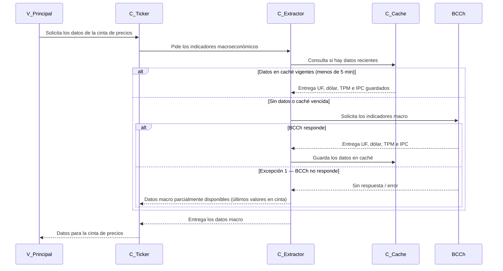
```mermaid
sequenceDiagram
    participant V as V_Principal
    participant CT as C_Ticker
    participant CE as C_Extractor
    participant CC as C_Cache
    participant B as BCCh
    V ->> CT: Solicita los datos de la cinta de precios
    CT ->> CE: Pide los indicadores macroeconómicos
    CE ->> CC: Consulta si hay datos recientes
    alt Datos en caché vigentes (menos de 5 min)
        CC -->> CE: Entrega UF, dólar, TPM e IPC guardados
    else Sin datos o caché vencida
        CE ->> B: Solicita los indicadores macro
        alt BCCh responde
            B -->> CE: Entrega UF, dólar, TPM e IPC
            CE ->> CC: Guarda los datos en caché
        else Excepción 1 — BCCh no responde
            B -->> CE: Sin respuesta / error
            CE -->> CT: Datos macro parcialmente disponibles (últimos valores en cinta)
        end
    end
    CE -->> CT: Entrega los datos macro
    CT -->> V: Datos para la cinta de precios
```

**Notas**: la cinta también incluye IPSA + las 30 acciones vía `get_quotes` (Yahoo), pero eso corresponde al flujo de CU-16/CU-17.

---

## CU-05: Actualizando indicadores respetando los límites de la API

**Ruta / archivo**: `src/extractor/cache.py:TTLCache.get` (verificación TTL) + `src/extractor/sources.py:_retry` (3 reintentos por defecto).

> ⚠️ **Divergencia con la memoria**: la Excepción 1 de la tabla dice "el sistema entrega el último valor en caché disponible" cuando se alcanza el límite de la API. El código actual **no implementa** ese fallback stale-while-error: si la API falla tras los reintentos, se propaga `ExtractionError`. El diagrama refleja el código real.

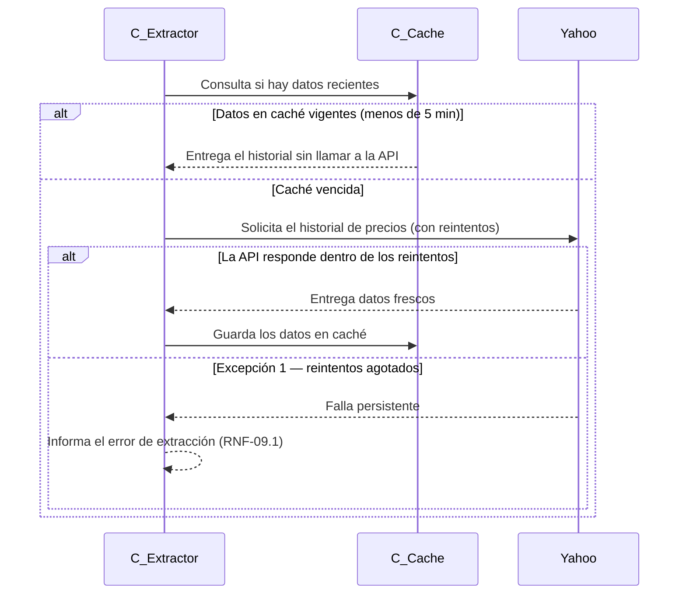
```mermaid
sequenceDiagram
    participant CE as C_Extractor
    participant CC as C_Cache
    participant Y as Yahoo
    CE ->> CC: Consulta si hay datos recientes
    alt Datos en caché vigentes (menos de 5 min)
        CC -->> CE: Entrega el historial sin llamar a la API
    else Caché vencida
        CE ->> Y: Solicita el historial de precios (con reintentos)
        alt La API responde dentro de los reintentos
            Y -->> CE: Entrega datos frescos
            CE ->> CC: Guarda los datos en caché
        else Excepción 1 — reintentos agotados
            Y -->> CE: Falla persistente
            CE -->> CE: Informa el error de extracción (RNF-09.1)
        end
    end
```

**Notas**: la política de "respeto de rate limits" está implementada como caché de 5 minutos por `(símbolo, días)`. No hay contador global de llamadas por minuto.

---

## CU-06: Validando formato y rango de los indicadores extraídos

**Ruta / archivo**: `src/extractor/__init__.py:_validate_inputs` (valida `days`, `indicator`, `interval`) + `src/extractor/indicators.py:compute_indicator` (lanza `ValueError` si datos insuficientes).

> ⚠️ **Divergencia con la memoria**: la tabla describe validación por rango numérico específico ("RSI entre 0 y 100, %B entre 0 y 1, MACD y MAs finitos"). El código actual **no valida el rango del valor calculado**; solo valida el input (nombre del indicador, período, intervalo) y captura errores de cálculo cuando faltan datos. El diagrama refleja el código real.

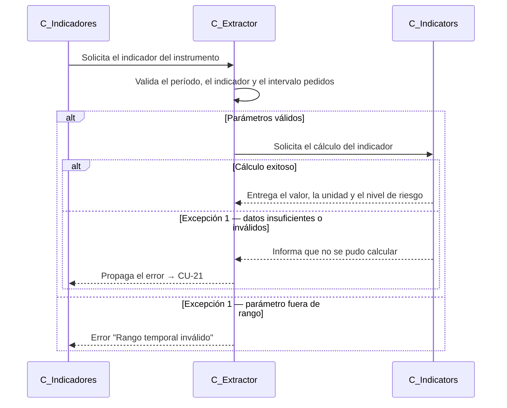
```mermaid
sequenceDiagram
    participant CI as C_Indicadores
    participant CE as C_Extractor
    participant CIn as C_Indicators
    CI ->> CE: Solicita el indicador del instrumento
    CE ->> CE: Valida el período, el indicador y el intervalo pedidos
    alt Parámetros válidos
        CE ->> CIn: Solicita el cálculo del indicador
        alt Cálculo exitoso
            CIn -->> CE: Entrega el valor, la unidad y el nivel de riesgo
        else Excepción 1 — datos insuficientes o inválidos
            CIn -->> CE: Informa que no se pudo calcular
            CE -->> CI: Propaga el error → CU-21
        end
    else Excepción 1 — parámetro fuera de rango
        CE -->> CI: Error "Rango temporal inválido"
    end
```

**Notas**: `VALID_PERIODS = (30, 90, 180, 365)` e `INDICATOR_TYPES = ("rsi", "medias_moviles", "macd", "bandas_bollinger")` son las únicas validaciones estrictas del input. Cualquier valor fuera de rango del propio indicador (por ejemplo RSI > 100) sería un error de cálculo, no un caso a validar.

---

## CU-07: Normalizando los indicadores a una estructura común

**Ruta / archivo**: `src/extractor/sources.py:_fetch_yahoo` / `_fetch_alpha_vantage` (normalizan records a `{date, open, high, low, close}`) + `src/extractor/__init__.py:get_indicator` (agrega `symbol`, `source`, `extracted_at`, `period_days`).

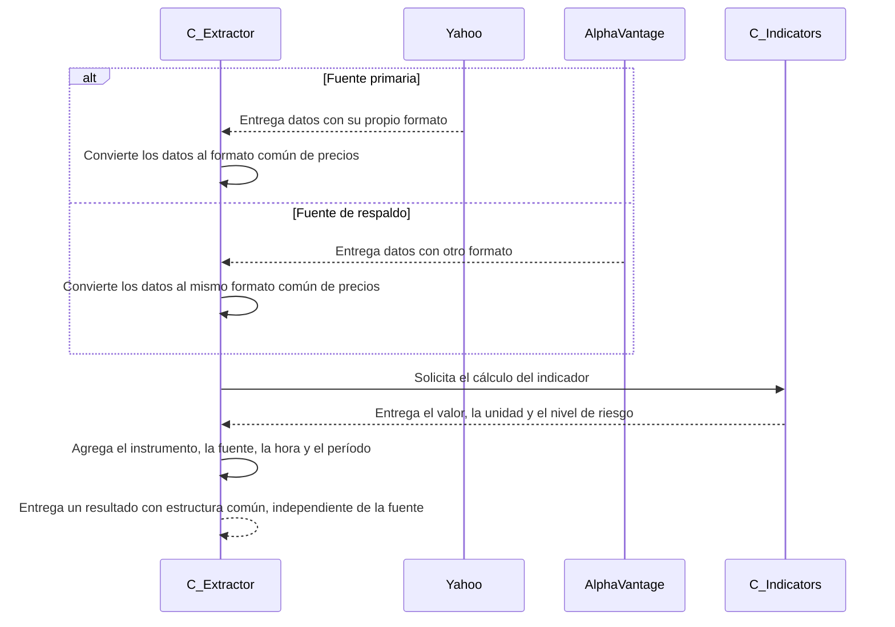
```mermaid
sequenceDiagram
    participant CE as C_Extractor
    participant Y as Yahoo
    participant AV as AlphaVantage
    participant CIn as C_Indicators
    alt Fuente primaria
        Y -->> CE: Entrega datos con su propio formato
        CE ->> CE: Convierte los datos al formato común de precios
    else Fuente de respaldo
        AV -->> CE: Entrega datos con otro formato
        CE ->> CE: Convierte los datos al mismo formato común de precios
    end
    CE ->> CIn: Solicita el cálculo del indicador
    CIn -->> CE: Entrega el valor, la unidad y el nivel de riesgo
    CE ->> CE: Agrega el instrumento, la fuente, la hora y el período
    CE -->> CE: Entrega un resultado con estructura común, independiente de la fuente
```

**Notas**: la normalización tiene dos niveles — primero los datos de precios (uniformes entre Yahoo y Alpha Vantage) y luego el resultado del indicador (uniforme entre RSI, MACD, medias móviles y Bollinger).

---

## CU-08: Procesando el indicador mediante el modelo de lenguaje

**Ruta / archivo**: `src/nlp/explainer.py:generate_explanation` → `_finbert_signal` (carga `ProsusAI/finbert` vía `transformers.pipeline`).

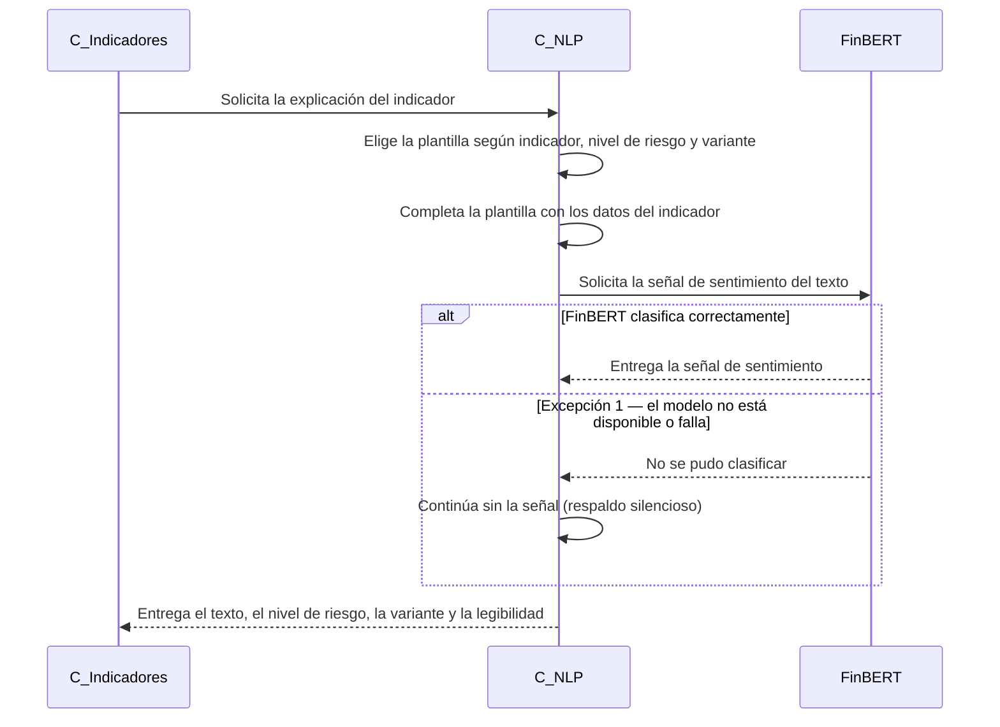
```mermaid
sequenceDiagram
    participant CI as C_Indicadores
    participant CN as C_NLP
    participant FB as FinBERT
    CI ->> CN: Solicita la explicación del indicador
    CN ->> CN: Elige la plantilla según indicador, nivel de riesgo y variante
    CN ->> CN: Completa la plantilla con los datos del indicador
    CN ->> FB: Solicita la señal de sentimiento del texto
    alt FinBERT clasifica correctamente
        FB -->> CN: Entrega la señal de sentimiento
    else Excepción 1 — el modelo no está disponible o falla
        FB -->> CN: No se pudo clasificar
        CN ->> CN: Continúa sin la señal (respaldo silencioso)
    end
    CN -->> CI: Entrega el texto, el nivel de riesgo, la variante y la legibilidad
```

**Notas**: FinBERT está default-on desde el Bloque 2 del refactor (`USE_FINBERT=true`). El respaldo silencioso mantiene el sistema operativo bajo RNF-09.

---

## CU-09: Validando la explicación generada contra el dato real

**Ruta / archivo**: `src/nlp/validator.py:validate_coherence` (invocado desde `src/web/routes.py:_log_and_validate`).

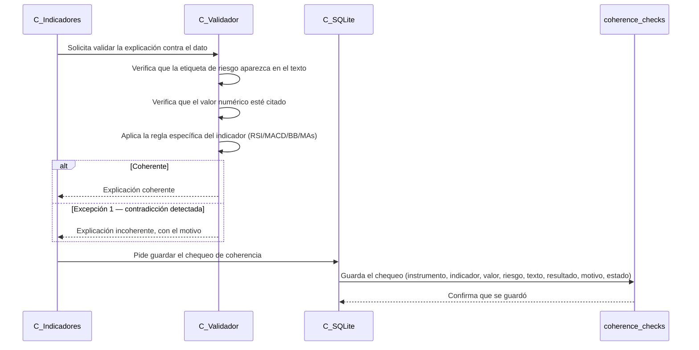
```mermaid
sequenceDiagram
    participant CI as C_Indicadores
    participant CV as C_Validador
    participant CS as C_SQLite
    participant TC as coherence_checks
    CI ->> CV: Solicita validar la explicación contra el dato
    CV ->> CV: Verifica que la etiqueta de riesgo aparezca en el texto
    CV ->> CV: Verifica que el valor numérico esté citado
    CV ->> CV: Aplica la regla específica del indicador (RSI/MACD/BB/MAs)
    alt Coherente
        CV -->> CI: Explicación coherente
    else Excepción 1 — contradicción detectada
        CV -->> CI: Explicación incoherente, con el motivo
    end
    CI ->> CS: Pide guardar el chequeo de coherencia
    CS ->> TC: Guarda el chequeo (instrumento, indicador, valor, riesgo, texto, resultado, motivo, estado)
    TC -->> CS: Confirma que se guardó
```

**Notas**: los casos incoherentes quedan con estado "pendiente" para que la investigadora los revise vía CU-08 (Auditoría). Los coherentes se marcan como "revisado" automáticamente.

---

## CU-10: Generando una explicación comprensible

**Ruta / archivo**: `src/nlp/explainer.py:generate_explanation` — selección de plantilla, llenado, referencia nacional, extra de detalle, truncado a MAX_WORDS, cálculo de legibilidad.

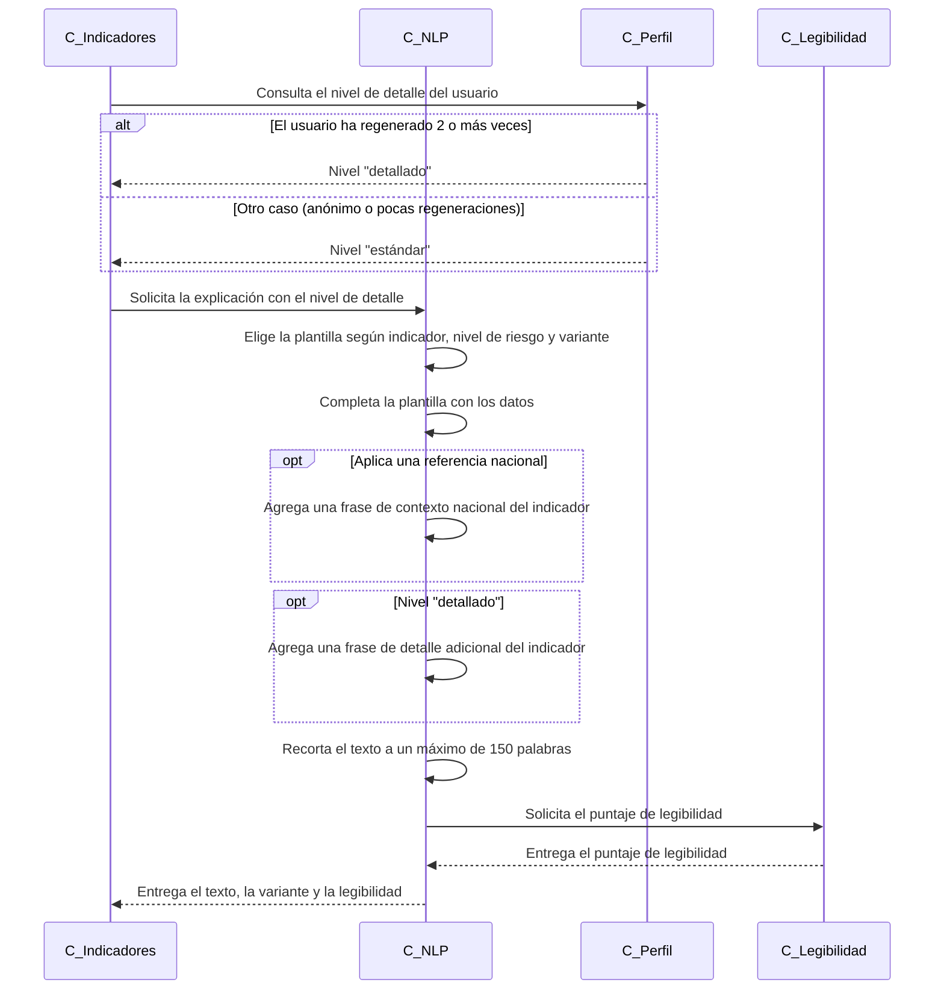
```mermaid
sequenceDiagram
    participant CI as C_Indicadores
    participant CN as C_NLP
    participant CP as C_Perfil
    participant CR as C_Legibilidad
    CI ->> CP: Consulta el nivel de detalle del usuario
    alt El usuario ha regenerado 2 o más veces
        CP -->> CI: Nivel "detallado"
    else Otro caso (anónimo o pocas regeneraciones)
        CP -->> CI: Nivel "estándar"
    end
    CI ->> CN: Solicita la explicación con el nivel de detalle
    CN ->> CN: Elige la plantilla según indicador, nivel de riesgo y variante
    CN ->> CN: Completa la plantilla con los datos
    opt Aplica una referencia nacional
        CN ->> CN: Agrega una frase de contexto nacional del indicador
    end
    opt Nivel "detallado"
        CN ->> CN: Agrega una frase de detalle adicional del indicador
    end
    CN ->> CN: Recorta el texto a un máximo de 150 palabras
    CN ->> CR: Solicita el puntaje de legibilidad
    CR -->> CN: Entrega el puntaje de legibilidad
    CN -->> CI: Entrega el texto, la variante y la legibilidad
```

**Notas**: RF-04.2 (extensión ≤ 150 palabras) se satisface al recortar el texto. RNF-04.1 (legibilidad Fernández-Huerta) se calcula pero no se rechaza el texto si no cumple — solo se registra el puntaje.

---

---

## CU-11: Adaptando el nivel de detalle al usuario no experto

**Ruta / archivo**: `src/profile/service.py:get_detail_level` (consulta `query_logs`), invocado desde `src/web/routes.py:_run_query` antes de pasar `detail_level` al Procesador NLP. La adaptación efectiva la aplica `src/nlp/explainer.py:generate_explanation` agregando `DETAIL_EXTRAS[indicador]` si el nivel es "detallado".

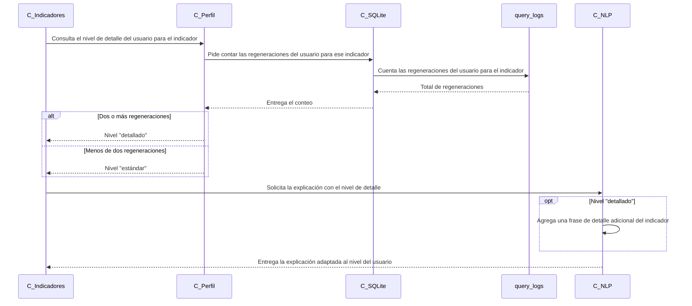
```mermaid
sequenceDiagram
    participant CI as C_Indicadores
    participant CP as C_Perfil
    participant CS as C_SQLite
    participant TQ as query_logs
    participant CN as C_NLP
    CI ->> CP: Consulta el nivel de detalle del usuario para el indicador
    CP ->> CS: Pide contar las regeneraciones del usuario para ese indicador
    CS ->> TQ: Cuenta las regeneraciones del usuario para el indicador
    TQ -->> CS: Total de regeneraciones
    CS -->> CP: Entrega el conteo
    alt Dos o más regeneraciones
        CP -->> CI: Nivel "detallado"
    else Menos de dos regeneraciones
        CP -->> CI: Nivel "estándar"
    end
    CI ->> CN: Solicita la explicación con el nivel de detalle
    opt Nivel "detallado"
        CN ->> CN: Agrega una frase de detalle adicional del indicador
    end
    CN -->> CI: Entrega la explicación adaptada al nivel del usuario
```

**Notas**: para usuarios anónimos (`user_id` = None) el nivel es siempre "estándar" y no se consulta la BD.

---

## CU-12: Clasificando el nivel de riesgo del indicador

**Ruta / archivo**: `src/extractor/indicators.py:compute_rsi`, `compute_moving_averages`, `compute_macd`, `compute_bollinger_bands`. Cada función clasifica su propio `risk_level` a partir de umbrales internos (no depende del NLP).

> ⚠️ **Divergencia con la memoria**: la tabla dice "El sistema calcula la categoría de riesgo del indicador procesado a partir del ancho de las Bandas de Bollinger". En el código, **cada indicador clasifica su propio riesgo** con umbrales propios (RSI por sobrecompra/sobreventa, medias móviles por diferencia porcentual, MACD por magnitud del histograma vs desviación típica, Bollinger por %B). No hay una clasificación global que dependa del ancho de las Bandas.

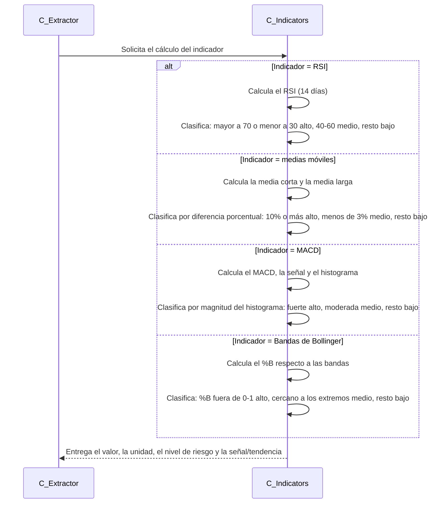
```mermaid
sequenceDiagram
    participant CE as C_Extractor
    participant CIn as C_Indicators
    CE ->> CIn: Solicita el cálculo del indicador
    alt Indicador = RSI
        CIn ->> CIn: Calcula el RSI (14 días)
        CIn ->> CIn: Clasifica: mayor a 70 o menor a 30 alto, 40-60 medio, resto bajo
    else Indicador = medias móviles
        CIn ->> CIn: Calcula la media corta y la media larga
        CIn ->> CIn: Clasifica por diferencia porcentual: 10% o más alto, menos de 3% medio, resto bajo
    else Indicador = MACD
        CIn ->> CIn: Calcula el MACD, la señal y el histograma
        CIn ->> CIn: Clasifica por magnitud del histograma: fuerte alto, moderada medio, resto bajo
    else Indicador = Bandas de Bollinger
        CIn ->> CIn: Calcula el %B respecto a las bandas
        CIn ->> CIn: Clasifica: %B fuera de 0-1 alto, cercano a los extremos medio, resto bajo
    end
    CIn -->> CE: Entrega el valor, la unidad, el nivel de riesgo y la señal/tendencia
```

**Notas**: la clasificación es determinística y por indicador. Se persiste en `QueryLog.risk_level` a través del flujo de CU-03.

---

## CU-13: Solicitando la regeneración de una explicación

**Ruta / archivo**: `src/web/routes.py:api_regenerate` (`POST /api/regenerate`), invocado desde `dashboard.js` al hacer clic en "No entendí esto". Reutiliza `_run_query` con `regenerate_explanation` y persiste otro `QueryLog` con `is_regeneration=True`.

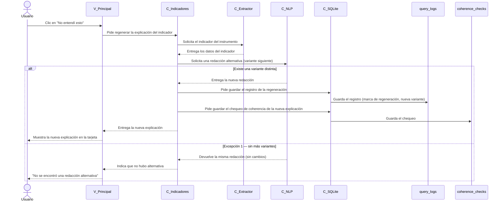
```mermaid
sequenceDiagram
    actor U as Usuario
    participant V as V_Principal
    participant CI as C_Indicadores
    participant CE as C_Extractor
    participant CN as C_NLP
    participant CS as C_SQLite
    participant TQ as query_logs
    participant TC as coherence_checks
    U ->> V: Clic en "No entendí esto"
    V ->> CI: Pide regenerar la explicación del indicador
    CI ->> CE: Solicita el indicador del instrumento
    CE -->> CI: Entrega los datos del indicador
    CI ->> CN: Solicita una redacción alternativa (variante siguiente)
    alt Existe una variante distinta
        CN -->> CI: Entrega la nueva redacción
        CI ->> CS: Pide guardar el registro de la regeneración
        CS ->> TQ: Guarda el registro (marca de regeneración, nueva variante)
        CI ->> CS: Pide guardar el chequeo de coherencia de la nueva explicación
        CS ->> TC: Guarda el chequeo
        CI -->> V: Entrega la nueva explicación
        V -->> U: Muestra la nueva explicación en la tarjeta
    else Excepción 1 — sin más variantes
        CN -->> CI: Devuelve la misma redacción (sin cambios)
        CI -->> V: Indica que no hubo alternativa
        V -->> U: "No se encontró una redacción alternativa"
    end
```

**Notas**: cada regeneración incrementa el conteo que alimenta CU-11 (a la próxima consulta el usuario recibirá el nivel "detallado" para ese indicador si acumula 2 o más).

---

## CU-14: Accediendo a la interfaz web del sistema

**Ruta / archivo**: `src/web/routes.py:index` (`GET /`) renderiza `templates/index.html`.

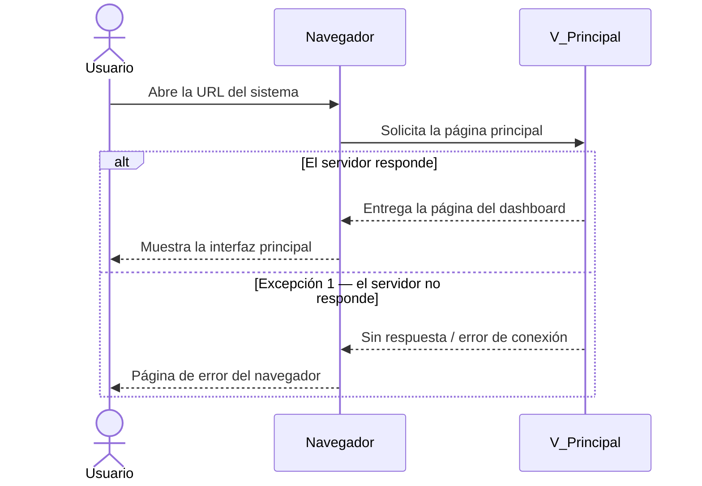
```mermaid
sequenceDiagram
    actor U as Usuario
    participant N as Navegador
    participant V as V_Principal
    U ->> N: Abre la URL del sistema
    N ->> V: Solicita la página principal
    alt El servidor responde
        V -->> N: Entrega la página del dashboard
        N -->> U: Muestra la interfaz principal
    else Excepción 1 — el servidor no responde
        V -->> N: Sin respuesta / error de conexión
        N -->> U: Página de error del navegador
    end
```

**Notas**: no toca la BD ni servicios de dominio. Es la puerta de entrada a la aplicación; cualquier flujo posterior parte de aquí.

---

## CU-15: Seleccionando el indicador financiero a consultar

**Ruta / archivo**: `src/web/templates/index.html` define `APP_INDICATORS` (lista estática de los cuatro indicadores). `src/web/static/js/dashboard.js:loadIndicators` los recorre y dispara una llamada a `/api/query` por cada uno.

> ⚠️ **Divergencia con la memoria**: la tabla implica que el usuario **elige un indicador** de una lista antes de la consulta. En el código real, los **cuatro indicadores** (RSI, medias móviles, MACD, Bandas de Bollinger) se cargan automáticamente en paralelo al seleccionar un instrumento. No hay un paso donde el usuario seleccione un indicador específico entre varios.

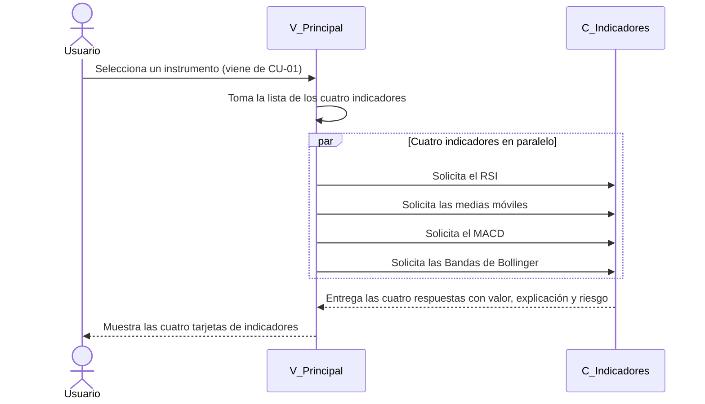
```mermaid
sequenceDiagram
    actor U as Usuario
    participant V as V_Principal
    participant CI as C_Indicadores
    U ->> V: Selecciona un instrumento (viene de CU-01)
    V ->> V: Toma la lista de los cuatro indicadores
    par Cuatro indicadores en paralelo
        V ->> CI: Solicita el RSI
        V ->> CI: Solicita las medias móviles
        V ->> CI: Solicita el MACD
        V ->> CI: Solicita las Bandas de Bollinger
    end
    CI -->> V: Entrega las cuatro respuestas con valor, explicación y riesgo
    V -->> U: Muestra las cuatro tarjetas de indicadores
```

**Notas**: si se quisiera implementar la memoria fielmente, habría que agregar un selector de indicador único en la interfaz. El diseño actual privilegia mostrar los cuatro simultáneamente para no ocultar información.

---

## CU-16: Visualizando la cinta de precios

**Ruta / archivo**: `src/web/templates/base.html` incluye el div `#ticker-tape` y carga `static/js/ticker.js` en todas las páginas.

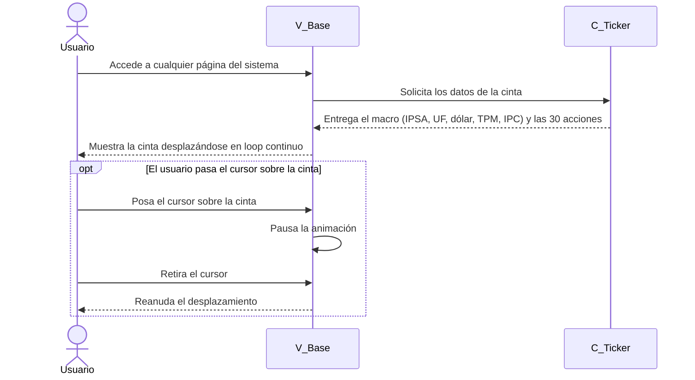
```mermaid
sequenceDiagram
    actor U as Usuario
    participant V as V_Base
    participant CT as C_Ticker
    U ->> V: Accede a cualquier página del sistema
    V ->> CT: Solicita los datos de la cinta
    CT -->> V: Entrega el macro (IPSA, UF, dólar, TPM, IPC) y las 30 acciones
    V -->> U: Muestra la cinta desplazándose en loop continuo
    opt El usuario pasa el cursor sobre la cinta
        U ->> V: Posa el cursor sobre la cinta
        V ->> V: Pausa la animación
        U ->> V: Retira el cursor
        V -->> U: Reanuda el desplazamiento
    end
```

**Notas**: es visualmente parte de todas las vistas porque vive en `base.html`. Los datos vienen del flujo detallado en CU-17.

---

## CU-17: Desplegando el contenido de la cinta de precios

**Ruta / archivo**: `src/web/routes.py:api_ticker` — combina `get_macro_indicators()` (mindicador.cl) con `get_quotes()` (Yahoo Finance, incluye IPSA + las 30 acciones).

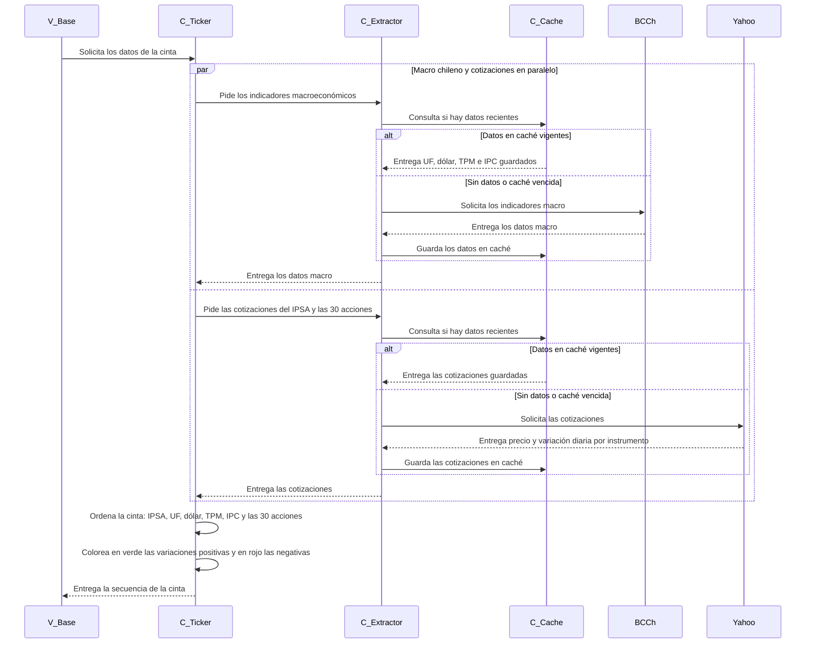
```mermaid
sequenceDiagram
    participant V as V_Base
    participant CT as C_Ticker
    participant CE as C_Extractor
    participant CC as C_Cache
    participant B as BCCh
    participant Y as Yahoo
    V ->> CT: Solicita los datos de la cinta
    par Macro chileno y cotizaciones en paralelo
        CT ->> CE: Pide los indicadores macroeconómicos
        CE ->> CC: Consulta si hay datos recientes
        alt Datos en caché vigentes
            CC -->> CE: Entrega UF, dólar, TPM e IPC guardados
        else Sin datos o caché vencida
            CE ->> B: Solicita los indicadores macro
            B -->> CE: Entrega los datos macro
            CE ->> CC: Guarda los datos en caché
        end
        CE -->> CT: Entrega los datos macro
    and
        CT ->> CE: Pide las cotizaciones del IPSA y las 30 acciones
        CE ->> CC: Consulta si hay datos recientes
        alt Datos en caché vigentes
            CC -->> CE: Entrega las cotizaciones guardadas
        else Sin datos o caché vencida
            CE ->> Y: Solicita las cotizaciones
            Y -->> CE: Entrega precio y variación diaria por instrumento
            CE ->> CC: Guarda las cotizaciones en caché
        end
        CE -->> CT: Entrega las cotizaciones
    end
    CT ->> CT: Ordena la cinta: IPSA, UF, dólar, TPM, IPC y las 30 acciones
    CT ->> CT: Colorea en verde las variaciones positivas y en rojo las negativas
    CT -->> V: Entrega la secuencia de la cinta
```

**Notas**: si BCCh no responde, la cinta muestra solo IPSA y las acciones (degradación tolerada por RNF-09). No toca BD.

---

## CU-18: Mostrando el valor original junto a la explicación

**Ruta / archivo**: `src/web/static/js/dashboard.js:renderCard` — arma el HTML de cada tarjeta con `data.value` y `data.explanation` que llegan del backend.

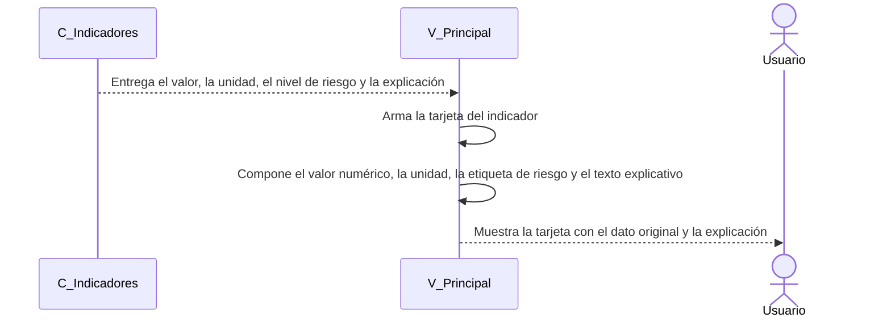
```mermaid
sequenceDiagram
    participant CI as C_Indicadores
    participant V as V_Principal
    actor U as Usuario
    CI -->> V: Entrega el valor, la unidad, el nivel de riesgo y la explicación
    V ->> V: Arma la tarjeta del indicador
    V ->> V: Compone el valor numérico, la unidad, la etiqueta de riesgo y el texto explicativo
    V -->> U: Muestra la tarjeta con el dato original y la explicación
```

**Notas**: es puramente UI posterior a CU-02/CU-10. No toca BD ni servicios externos.

---

## CU-19: Mostrando la etiqueta de riesgo

**Ruta / archivo**: `src/web/static/js/dashboard.js:riskBadgeText`, `riskBadgeClass`. Mapea `risk_level` a texto + clase CSS.

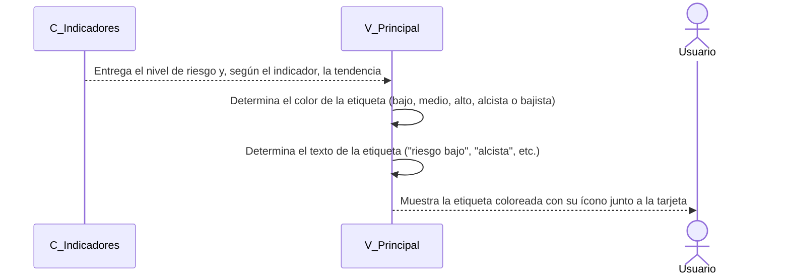
```mermaid
sequenceDiagram
    participant CI as C_Indicadores
    participant V as V_Principal
    actor U as Usuario
    CI -->> V: Entrega el nivel de riesgo y, según el indicador, la tendencia
    V ->> V: Determina el color de la etiqueta (bajo, medio, alto, alcista o bajista)
    V ->> V: Determina el texto de la etiqueta ("riesgo bajo", "alcista", etc.)
    V -->> U: Muestra la etiqueta coloreada con su ícono junto a la tarjeta
```

**Notas**: para medias móviles y MACD, la etiqueta refleja **tendencia** (alcista/bajista) en vez de nivel de riesgo. Cumple RF-08.2 (no depende solo del color: incluye ícono).

---

## CU-20: Mostrando el indicador de carga

**Ruta / archivo**: `src/web/static/js/dashboard.js:loadIndicators` maneja `#indicators-loading` y `#loading`. Se activa antes del `fetch` y se limpia en el `finally`.

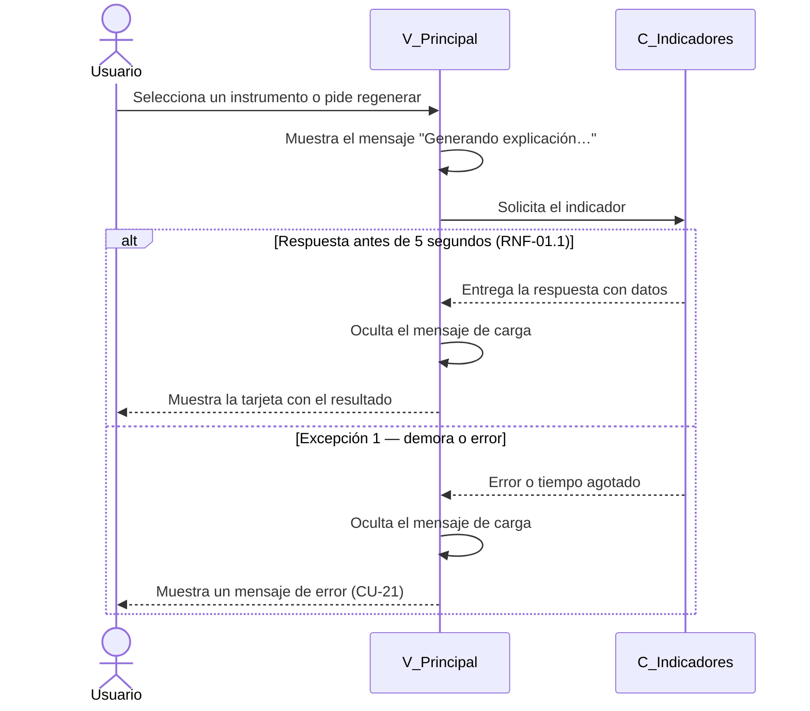
```mermaid
sequenceDiagram
    actor U as Usuario
    participant V as V_Principal
    participant CI as C_Indicadores
    U ->> V: Selecciona un instrumento o pide regenerar
    V ->> V: Muestra el mensaje "Generando explicación…"
    V ->> CI: Solicita el indicador
    alt Respuesta antes de 5 segundos (RNF-01.1)
        CI -->> V: Entrega la respuesta con datos
        V ->> V: Oculta el mensaje de carga
        V -->> U: Muestra la tarjeta con el resultado
    else Excepción 1 — demora o error
        CI -->> V: Error o tiempo agotado
        V ->> V: Oculta el mensaje de carga
        V -->> U: Muestra un mensaje de error (CU-21)
    end
```

**Notas**: no persiste nada. El indicador de carga es puramente UI.

---

## CU-21: Presentando un mensaje de error comprensible

**Ruta / archivo**: `src/web/routes.py` propaga `ExtractionError` como `{"error": mensaje}` con HTTP 502; `dashboard.js:showError` muestra el mensaje al usuario sin códigos HTTP.

```mermaid
sequenceDiagram
    actor U as Usuario
    participant V as V_Principal
    participant CI as C_Indicadores
    participant CE as C_Extractor
    V ->> CI: Solicita el indicador
    CI ->> CE: Solicita el indicador del instrumento
    alt Datos válidos
        CE -->> CI: Entrega los datos
        CI -->> V: Entrega el valor y la explicación
        V -->> U: Muestra la tarjeta
    else Excepción 1 — falla del Extractor tras los reintentos (RNF-09.2)
        CE -->> CI: Informa que no se pudo obtener el instrumento
        CI -->> V: Entrega un mensaje de error sin códigos técnicos
        V ->> V: Prepara el mensaje para el usuario
        V -->> U: "No fue posible obtener el instrumento seleccionado. Intenta nuevamente en unos minutos."
    end
```

**Notas**: los mensajes están redactados sin jerga técnica ni códigos HTTP, coherente con RF-09.1.

---

## CU-22: Consultando el glosario de términos financieros

**Ruta / archivo**: `src/web/routes.py:glossary_page` (`GET /glosario`) y `api_glossary_search` (`GET /api/glosario/buscar`) → `src/nlp/glossary.py:list_terms`, `search_terms`. Los términos viven en `data/glossary.json`.

```mermaid
sequenceDiagram
    actor U as Usuario
    participant V as V_Glosario
    participant CG as C_Glosario
    participant Gl as data/glossary.json
    U ->> V: Accede al glosario
    V ->> CG: Solicita el listado completo
    CG ->> Gl: Lee los términos y definiciones
    Gl -->> CG: Entrega la lista completa
    CG -->> V: Entrega los términos ordenados alfabéticamente
    V -->> U: Muestra el glosario
    opt El usuario busca un término
        U ->> V: Escribe una consulta en el buscador
        V ->> CG: Solicita filtrar por el término buscado
        CG ->> Gl: Filtra por coincidencia en el término o la definición
        alt Existen coincidencias
            Gl -->> CG: Entrega el subconjunto de términos
            CG -->> V: Entrega los resultados filtrados
            V -->> U: Muestra las coincidencias
        else Excepción 1 — sin coincidencias
            Gl -->> CG: Lista vacía
            CG -->> V: Sin resultados
            V -->> U: "No se encontraron resultados"
        end
    end
```

**Notas**: sin BD. El glosario también es un archivo estático como el catálogo de instrumentos.

---

## CU-23: Visualizando el historial de consultas

**Ruta / archivo**: `src/web/routes.py:history` (`GET /history`) lee `session.get("history", [])` (cookie Flask, RF-10.1). El historial se acumula desde `_push_history` en `/api/historial/visita`.

```mermaid
sequenceDiagram
    actor U as Usuario
    participant V as V_Historial
    participant CH as C_Historial
    participant SF as SesionFlask
    U ->> V: Accede al historial
    V ->> CH: Solicita el historial de la sesión
    CH ->> SF: Consulta el historial guardado en la sesión
    SF -->> CH: Entrega las últimas 5 consultas de la sesión activa
    alt Existen consultas
        CH -->> V: Entrega la lista de consultas
        V -->> U: Muestra las últimas 5 consultas con su fecha y hora
    else Excepción 1 — historial vacío
        CH -->> V: Sin consultas
        V -->> U: "Aún no has realizado consultas en esta sesión"
    end
```

**Notas**: el historial vive en la **cookie de sesión Flask**, no en la BD. Se limita a las últimas 5 consultas (RF-10.1) y se pierde al cerrar el navegador. Por eso no aparecen ni `C_SQLite` ni tabla.

---

## CU-24: Registrando cuenta de usuario

**Ruta / archivo**: `src/auth/routes.py:api_register` (`POST /api/auth/registro`) → `src/auth/service.py:register_user` → INSERT en `users`.

```mermaid
sequenceDiagram
    actor U as Usuario
    participant V as V_Registro
    participant CA as C_Autenticacion
    participant CS as C_SQLite
    participant TU as users
    U ->> V: Completa correo, contraseña y (opcional) casillero de consentimiento
    V ->> CA: Envía los datos de registro
    CA ->> CA: Valida el formato del correo y el largo mínimo de la contraseña
    CA ->> CS: Pide verificar que el correo no exista
    CS ->> TU: Busca el correo
    alt El correo no existe
        TU -->> CS: Sin coincidencias
        CS -->> CA: Correo disponible
        CA ->> CA: Cifra la contraseña
        CA ->> CS: Pide crear el usuario
        CS ->> TU: Guarda el usuario (correo, contraseña cifrada, consentimiento)
        TU -->> CS: Usuario creado
        CS -->> CA: Confirmación
        CA ->> CA: Genera la sesión segura del usuario
        CA -->> V: Confirma el registro e inicia sesión
        V -->> U: Redirige al dashboard con la sesión iniciada
    else Excepción 1 — correo ya registrado
        TU -->> CS: El usuario ya existe
        CS -->> CA: Conflicto
        CA -->> V: Informa que el correo ya está registrado
        V -->> U: "Ese correo ya está registrado. Inicia sesión"
    end
```

**Notas**: el registro deja al usuario autenticado sin pedir un login adicional (RF-11 mejorado). El consentimiento a evaluación se registra opcionalmente en `users.acepta_evaluacion` (movido desde el banner al registro en el Bloque 3 del refactor).

---

## CU-25: Iniciando y cerrando sesión

**Ruta / archivo**: `src/auth/routes.py:api_login` (`POST /api/auth/login`), `api_logout` (`POST /api/auth/logout`) → `src/auth/service.py:authenticate_user`. El logout persiste el `jti` del token en `revoked_tokens`.

Este caso de uso se documenta con **dos diagramas de secuencia** porque el inicio y el cierre de sesión ocurren en momentos temporalmente independientes (con toda una sesión de uso en medio) y cada flujo accede a una tabla distinta.

### CU-25a — Iniciando sesión

```mermaid
sequenceDiagram
    actor U as Usuario
    participant V as V_Login
    participant CA as C_Autenticacion
    participant CS as C_SQLite
    participant TU as users
    U ->> V: Ingresa correo y contraseña
    V ->> CA: Envía las credenciales
    CA ->> CS: Pide el usuario por correo
    CS ->> TU: Busca el usuario por correo
    TU -->> CS: Entrega el usuario y su contraseña cifrada
    CS -->> CA: Entrega el registro
    alt Credenciales correctas
        CA ->> CA: Verifica la contraseña
        CA ->> CA: Genera la sesión segura (válida 24 h)
        CA -->> V: Confirma el inicio de sesión
        V -->> U: Sesión iniciada
    else Excepción 1 — credenciales incorrectas
        CA -->> V: Rechaza el ingreso
        V -->> U: Mensaje genérico (no revela cuál dato falló)
    end
```

### CU-25b — Cerrando sesión

```mermaid
sequenceDiagram
    actor U as Usuario
    participant V as V_Login
    participant CA as C_Autenticacion
    participant CS as C_SQLite
    participant TR as revoked_tokens
    U ->> V: Clic en "Cerrar sesión"
    V ->> CA: Solicita cerrar la sesión
    CA ->> CS: Pide revocar la sesión actual
    CS ->> TR: Guarda la sesión revocada
    TR -->> CS: Confirma la revocación
    CS -->> CA: Sesión revocada
    CA -->> V: Confirma el cierre y limpia la sesión
    V -->> U: Sesión cerrada
```

**Notas**: la revocación de tokens (`revoked_tokens`) satisface RF-17.3. Después del cierre de sesión, cualquier reuso del token es rechazado.

---

## CU-26: Recuperando el perfil de aprendizaje al iniciar sesión

**Ruta / archivo**: `src/profile/routes.py:profile_page` (`GET /perfil`) → `src/profile/service.py:build_learning_profile`.

> ⚠️ **Divergencia con la memoria**: la tabla dice "al autenticarse, el sistema recupera el perfil". En el código real el perfil **no se carga en el login**; se computa **on-demand** cuando el usuario visita `/perfil`. El JWT solo transporta la identidad del usuario; el perfil es dinámico. El diagrama refleja el código real.

```mermaid
sequenceDiagram
    actor U as Usuario
    participant V as V_Perfil
    participant CP as C_Perfil
    participant CS as C_SQLite
    participant TIV as instrument_visits
    participant TQ as query_logs
    U ->> V: Accede a su perfil (autenticado)
    V ->> CP: Solicita construir el perfil de aprendizaje
    par Consultas paralelas al esquema
        CP ->> CS: Pide contar las visitas del usuario
        CS ->> TIV: Cuenta las visitas del usuario
        TIV -->> CS: Total de visitas
        CS -->> CP: Entrega el conteo
    and
        CP ->> CS: Pide contar las regeneraciones del usuario
        CS ->> TQ: Cuenta las regeneraciones del usuario
        TQ -->> CS: Total de regeneraciones
        CS -->> CP: Entrega el conteo
    and
        CP ->> CS: Pide los instrumentos más visitados
        CS ->> TIV: Agrupa las visitas por instrumento
        TIV -->> CS: Ranking de instrumentos
        CS -->> CP: Entrega la lista ordenada
    and
        CP ->> CS: Pide el ranking de regeneraciones por indicador
        CS ->> TQ: Agrupa las regeneraciones por indicador
        TQ -->> CS: Ranking de indicadores
        CS -->> CP: Entrega la lista ordenada
    end
    CP -->> V: Entrega el perfil consolidado
    V -->> U: Muestra "Mi perfil" con todas las métricas
```

**Notas**: cada visita al perfil recalcula. No hay caché del perfil ni carga en el login.

---

## CU-27: Ajustando explicaciones según el perfil de aprendizaje

**Ruta / archivo**: `src/profile/service.py:get_detail_level` invocado desde `src/web/routes.py:api_query`. Ver también CU-11 (mismo mecanismo).

```mermaid
sequenceDiagram
    actor U as Usuario
    participant V as V_Principal
    participant CI as C_Indicadores
    participant CP as C_Perfil
    participant CS as C_SQLite
    participant TQ as query_logs
    participant CN as C_NLP
    U ->> V: Consulta un indicador (autenticado)
    V ->> CI: Solicita el indicador
    CI ->> CP: Consulta el nivel de detalle del usuario para el indicador
    CP ->> CS: Pide contar las regeneraciones previas para ese usuario e indicador
    CS ->> TQ: Cuenta las regeneraciones
    TQ -->> CS: Total
    CS -->> CP: Entrega el conteo
    alt Dos o más regeneraciones
        CP -->> CI: Nivel "detallado"
    else Menos de dos
        CP -->> CI: Nivel "estándar"
    end
    CI ->> CN: Solicita la explicación con el nivel de detalle
    CN -->> CI: Entrega el texto adaptado
    CI -->> V: Entrega la explicación ajustada al perfil
    V -->> U: Muestra la tarjeta con el nivel de detalle acorde a su historial
```

**Notas**: complementa a CU-11 desde la perspectiva del sistema completo. La diferencia entre ambos casos de uso es sutil en la memoria; en el código es exactamente el mismo mecanismo (`get_detail_level`).

---

## CU-28: Visualizando el indicador más regenerado

**Ruta / archivo**: `src/profile/service.py:build_learning_profile` — bloque `regeneration_rows` calcula `top_indicator` = indicador con más regeneraciones del usuario.

```mermaid
sequenceDiagram
    actor U as Usuario
    participant V as V_Perfil
    participant CP as C_Perfil
    participant CS as C_SQLite
    participant TQ as query_logs
    U ->> V: Accede a su perfil
    V ->> CP: Solicita construir el perfil de aprendizaje
    CP ->> CS: Pide el ranking de indicadores regenerados
    CS ->> TQ: Agrupa las regeneraciones del usuario por indicador, de mayor a menor
    TQ -->> CS: Filas ordenadas
    CS -->> CP: Entrega el ranking
    alt Existen regeneraciones
        CP -->> V: Entrega el indicador más regenerado y su conteo
        V -->> U: "Indicador que más te ha costado: MACD (3 regeneraciones)"
    else Excepción 1 — sin regeneraciones aún
        CP -->> V: Sin indicador destacado
        V -->> U: "Aún no hay datos suficientes"
    end
```

---

## CU-29: Visualizando los instrumentos más consultados

**Ruta / archivo**: `src/profile/service.py:build_learning_profile` — bloque `top_instruments_rows`.

```mermaid
sequenceDiagram
    actor U as Usuario
    participant V as V_Perfil
    participant CP as C_Perfil
    participant CS as C_SQLite
    participant TIV as instrument_visits
    U ->> V: Accede a su perfil
    V ->> CP: Solicita construir el perfil de aprendizaje
    CP ->> CS: Pide los 5 instrumentos más visitados
    CS ->> TIV: Agrupa las visitas del usuario por instrumento, de mayor a menor
    TIV -->> CS: Ranking
    CS -->> CP: Entrega la lista de instrumentos
    alt Existen visitas
        CP -->> V: Entrega los instrumentos y sus totales
        V -->> U: Muestra el ranking con cinco instrumentos y sus totales
    else Excepción 1 — sin visitas previas
        CP -->> V: Sin instrumentos
        V -->> U: "Aún no has consultado ningún instrumento"
    end
```

---

## CU-30: Visualizando el total de consultas realizadas

**Ruta / archivo**: `src/profile/service.py:build_learning_profile` — `total_queries = visit_count + regeneration_count` (RF-19.3).

```mermaid
sequenceDiagram
    actor U as Usuario
    participant V as V_Perfil
    participant CP as C_Perfil
    participant CS as C_SQLite
    participant TIV as instrument_visits
    participant TQ as query_logs
    U ->> V: Accede a su perfil
    V ->> CP: Solicita construir el perfil de aprendizaje
    par Dos conteos en paralelo
        CP ->> CS: Pide el total de visitas del usuario
        CS ->> TIV: Cuenta las visitas del usuario
        TIV -->> CS: Total de visitas
        CS -->> CP: Entrega el conteo
    and
        CP ->> CS: Pide el total de regeneraciones del usuario
        CS ->> TQ: Cuenta las regeneraciones del usuario
        TQ -->> CS: Total de regeneraciones
        CS -->> CP: Entrega el conteo
    end
    CP ->> CP: Suma las visitas y las regeneraciones
    CP -->> V: Entrega el total de consultas
    V -->> U: Muestra "Consultas totales: 12" (RF-19.3)
```

**Notas**: la memoria pide contar "consultas totales" como acciones del usuario, no el registro bruto (que se infla por las 4 llamadas paralelas por indicador). El cálculo visitas + regeneraciones respeta esa intención.

---

## CU-31: Presentando la explicación del indicador más difícil

**Ruta / archivo**: `src/profile/service.py:build_learning_profile` — al identificar `top_indicator`, además busca el último `QueryLog` para ese indicador y devuelve `top_indicator_explanation` con su texto.

```mermaid
sequenceDiagram
    actor U as Usuario
    participant V as V_Perfil
    participant CP as C_Perfil
    participant CS as C_SQLite
    participant TQ as query_logs
    U ->> V: Accede a su perfil
    V ->> CP: Solicita construir el perfil de aprendizaje
    CP ->> CS: Pide identificar el indicador más regenerado
    CS ->> TQ: Agrupa las regeneraciones por indicador, de mayor a menor
    TQ -->> CS: Ranking
    CS -->> CP: Entrega el indicador más difícil
    CP ->> CS: Pide la última explicación de ese indicador
    CS ->> TQ: Busca el registro más reciente del usuario para ese indicador
    TQ -->> CS: Registro más reciente
    CS -->> CP: Entrega el instrumento, el texto y la variante
    CP -->> V: Entrega el indicador difícil con su explicación y su instrumento
    V -->> U: Muestra la tarjeta destacada del "indicador que más te ha costado"
```

**Notas**: reutiliza la última explicación guardada — no vuelve a llamar al Procesador NLP en la visita al perfil. La regeneración desde el perfil está en CU-32.

---

## CU-32: Reutilizando la última explicación generada

**Ruta / archivo**: `src/profile/routes.py:api_profile_regenerate` (`POST /api/perfil/regenerar`). Cuando el usuario pide una nueva explicación, se llama a `get_indicator` + `generate_explanation` con `variant = last_log.variant + 1` y `detail_level = "detallado"`; el resultado se persiste como un nuevo `QueryLog` con `is_regeneration=True`.

```mermaid
sequenceDiagram
    actor U as Usuario
    participant V as V_Perfil
    participant CP as C_Perfil
    participant CS as C_SQLite
    participant TQ as query_logs
    participant CE as C_Extractor
    participant CN as C_NLP
    U ->> V: Abre su perfil
    V ->> CP: Solicita construir el perfil de aprendizaje
    CP ->> CS: Pide la última explicación del indicador más difícil
    CS ->> TQ: Busca el registro más reciente del usuario para ese indicador
    TQ -->> CS: Texto guardado
    CS -->> CP: Entrega la última explicación disponible
    CP -->> V: Reutiliza el texto (no invoca al NLP)
    V -->> U: Muestra la explicación guardada del indicador más difícil
    opt El usuario pide regenerar (RF-14.5)
        U ->> V: Clic en "Explicar de otra forma"
        V ->> CP: Solicita regenerar la explicación
        CP ->> CS: Pide el último registro del indicador difícil
        CS ->> TQ: Busca el registro más reciente
        TQ -->> CS: Registro más reciente
        CS -->> CP: Entrega la variante y el instrumento
        CP ->> CE: Solicita los datos frescos del indicador
        CE -->> CP: Entrega los datos
        CP ->> CN: Solicita una nueva redacción (variante siguiente, nivel detallado)
        CN -->> CP: Entrega la nueva redacción
        CP ->> CS: Pide guardar el registro de la regeneración
        CS ->> TQ: Guarda el registro
        CP -->> V: Entrega la nueva explicación
        V -->> U: Reemplaza la tarjeta con la nueva explicación
    end
```

**Notas**: la reutilización silenciosa evita cargar al Procesador NLP en cada visita al perfil (optimización descrita en RF-14.5). El usuario tiene el escape explícito de "regenerar" si el texto ya no le sirve.

---

## Estado de implementación (CU-01 a CU-32)

| CU | Estado en el código | Notas |
|---|---|---|
| CU-01 | ✅ Implementado | Sin BD; flujo puramente UI |
| CU-02 | ✅ Implementado | Fallback Yahoo → Alpha Vantage funcional |
| CU-03 | ✅ Implementado | Persiste en `query_logs` |
| CU-04 | ✅ Implementado | Con degradación parcial si BCCh falla |
| CU-05 | ⚠️ Parcial | TTL 5 min sí; stale-while-error de la Excepción 1 **no** |
| CU-06 | ⚠️ Parcial | Valida input; **no** valida rango del valor calculado |
| CU-07 | ✅ Implementado | Doble normalización (precios + resultado del indicador) |
| CU-08 | ✅ Implementado | FinBERT default-on con respaldo silencioso |
| CU-09 | ✅ Implementado | Persiste `coherence_checks` con motivo |
| CU-10 | ✅ Implementado | Perfil adaptativo + plantillas + legibilidad |
| CU-11 | ✅ Implementado | `get_detail_level` + `DETAIL_EXTRAS` |
| CU-12 | ⚠️ Parcial | La clasificación NO depende del ancho de Bandas de Bollinger como dice la memoria; cada indicador tiene sus propios umbrales |
| CU-13 | ✅ Implementado | `/api/regenerate` funcional |
| CU-14 | ✅ Implementado | Ruta `/` con `index.html` |
| CU-15 | ⚠️ Parcial | El usuario NO elige un indicador entre varios; los 4 se cargan en paralelo automáticamente |
| CU-16 | ✅ Implementado | Cinta visible en `base.html` |
| CU-17 | ✅ Implementado | Composición desde `api_ticker` con macro + cotizaciones |
| CU-18 | ✅ Implementado | UI de tarjeta con valor y explicación |
| CU-19 | ✅ Implementado | Etiqueta con texto + ícono + color |
| CU-20 | ✅ Implementado | Spinner de carga |
| CU-21 | ✅ Implementado | Mensajes sin códigos HTTP |
| CU-22 | ✅ Implementado | Glosario desde `data/glossary.json` |
| CU-23 | ✅ Implementado | Historial en cookie de sesión (no BD) |
| CU-24 | ✅ Implementado | Registro con consentimiento opcional |
| CU-25 | ✅ Implementado | Login/logout con revocación de token (dos diagramas: 25a inicio, 25b cierre) |
| CU-26 | ⚠️ Parcial | El perfil NO se carga al login; se computa on-demand al visitar `/perfil` |
| CU-27 | ✅ Implementado | Mismo mecanismo que CU-11 |
| CU-28 | ✅ Implementado | Ranking de regeneraciones por indicador |
| CU-29 | ✅ Implementado | Top 5 instrumentos visitados |
| CU-30 | ✅ Implementado | `visit + regeneración` según RF-19.3 |
| CU-31 | ✅ Implementado | Reutiliza `explanation_text` del último `QueryLog` |
| CU-32 | ✅ Implementado | Regeneración explícita vía `/api/perfil/regenerar` |

**Resumen de divergencias con la memoria** (importantes para la defensa): CU-05, CU-06, CU-12, CU-15 y CU-26 tienen diferencias documentadas entre lo que describe la tabla del anteproyecto y lo que implementa el código real. En cada caso el diagrama refleja el código, y la divergencia se explica en la nota del caso de uso correspondiente.
